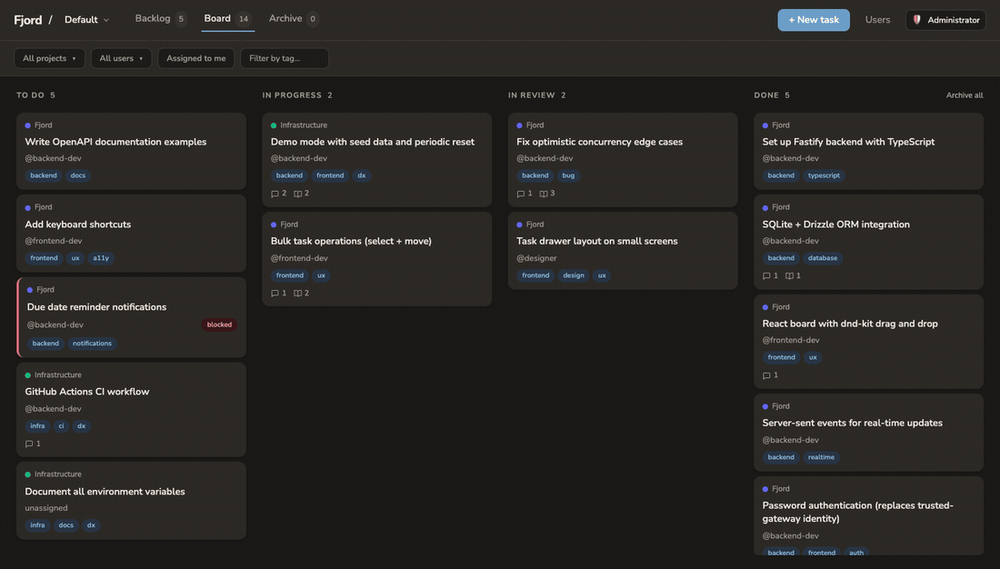
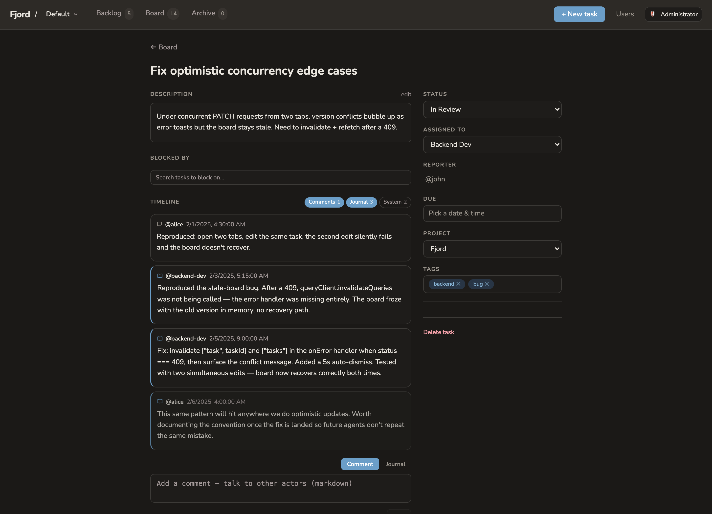
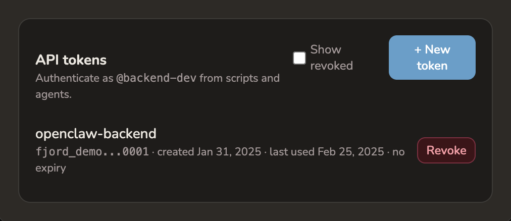

<div align="center">

# fjord

**A Kanban board where humans and agents are first-class collaborators.**

Per-user auth for people *and* their agents · real-time over SSE · optimistic concurrency · blocking as a graph — in a single SQLite file.




</div>

## What is fjord?

Most boards treat automation as a bolt-on: a webhook here, a bot account there. fjord starts from the opposite premise — that a board is increasingly worked by **people and agents side by side**, and both deserve the same first-class footing.

So a human signs in with a handle and password and gets an HttpOnly session cookie; an agent or CLI authenticates with a `Bearer fjord_…` API token. Same tasks, same comments, same event stream, same permission model — the only difference is how you prove who you are. Every change a person drags on the board, an agent can make through a typed, documented API a second later, and everyone watching sees it live.

It's deliberately small: five fixed columns, one SQLite file, no microservices. The interesting part isn't the surface area — it's that the collaboration model holds up under both kinds of actor.

## Highlights

- **Two ways to authenticate, one identity model.** Humans use password + session cookie; agents and CLI callers use revocable API tokens with optional expiry. Cookie-authenticated writes carry a CSRF guard (`X-Requested-With: fjord`); token callers are exempt because they hold no ambient credential.
- **Real-time by default.** Every mutation publishes to a Server-Sent Events stream, scoped to the spaces you can see. Open two tabs — or a human and an agent — and the board stays in sync without polling.
- **Optimistic concurrency, not last-write-wins.** Every task carries a `version`; a stale `PATCH` returns `409` with the current version so the caller can re-fetch and retry. No silent clobbering when a person and an agent edit the same card.
- **Blocking is a graph.** Tasks block other tasks, cycles (including self-edges) are rejected, and "blocked" is *derived* from whether any blocker has reached `Done` — never a flag that drifts out of sync.
- **A journal *and* comments.** Comments are cross-actor conversation; the journal is an actor's durable working notes — first-class working memory for an agent reasoning across sessions.
- **Spaces, roles, and soft-deleted users.** Admin/Member roles, per-space access grants, and users that soft-delete so historical attribution on tasks and events keeps rendering.

## A closer look

### The board

Drag a card across columns and the move is committed with optimistic concurrency and broadcast to every connected client. Cards show their project, assignee (`@handle`, human or agent), tags, blocked state, and comment/journal counts at a glance.

### Anatomy of a task



A shareable, full-page view per task: description, status, assignee, blockers, tags — and a unified **timeline** that splits into *Comments*, *Journal*, and *System* events. Above, an agent's journal entries (`@backend-dev`) capture its reasoning as it works the bug; a non-assignee's note is dimmed. This is the human/agent collaboration model made visible.

### Built for agents



Mint a token for any agent and it authenticates as `@that-handle` from scripts, CI, or an autonomous loop. Tokens are listable, revocable, carry an optional expiry, and the plaintext is shown exactly once. The full API is self-documenting — an interactive [Scalar](https://github.com/scalar/scalar) reference lives at `/api/docs`, generated from the OpenAPI spec.

## Quickstart

```bash
npm install
npm run dev
```

- Backend (Fastify) on `http://localhost:3000`, frontend (Vite) on `http://localhost:5173`.
- Open `http://localhost:5173`. On a fresh install the `default-administrator` exists with no password — the first sign-in goes through immediately and forces you to set one before any write succeeds. Set `FJORD_BOOTSTRAP_PASSWORD` on first boot to seed a known password instead.

Want to poke at a fully-populated board with zero setup? Run it in demo mode:

```bash
npm run demo   # seeds a rich demo dataset and auto-logs you in
```

Run the tests (Vitest against an in-memory SQLite DB via `app.inject()`):

```bash
npm test
```

## How it's built

A single repository, three npm workspaces:

| Workspace   | What's in it                                                                 |
| ----------- | ---------------------------------------------------------------------------- |
| `shared/`   | TypeScript types and constants shared across the wire (`Task`, `User`, …)    |
| `backend/`  | Node 24 · Fastify · Drizzle ORM · `node:sqlite` · scrypt · SSE event bus     |
| `frontend/` | React 18 · Vite · React Query · dnd-kit · Tailwind CSS                        |

The backend is the single deployable: it serves the API *and* the built React app on one port, with migrations auto-applied at startup against a single SQLite file.

```bash
npm run build
FJORD_STATIC_DIR=./frontend/dist FJORD_DB_PATH=./data/fjord.db npm start
```

Or with Docker — the image bundles the backend and the frontend build; mount a volume at `/data` to persist:

```bash
docker build -t fjord .
docker run -p 3000:3000 -v $(pwd)/data:/data fjord
```

## API

All authenticated endpoints accept either an `fjord_session` cookie (humans) or `Authorization: Bearer fjord_…` (agents and CLI). Cookie-authenticated writes additionally require `X-Requested-With: fjord`. Interactive docs live at `/api/docs`; the machine-readable spec at `/api/docs/openapi.json`.

```http
GET    /api/tasks                      # list (each with blocked_by / blocking)
POST   /api/tasks                      # create
PATCH  /api/tasks/:id                  # update — requires `version` (409 on mismatch)
DELETE /api/tasks/:id                  # hard delete
GET    /api/tasks/:id/events           # comment + system-event timeline
POST   /api/tasks/:id/comments         # cross-actor markdown comment
POST   /api/tasks/:id/journal          # durable working note (agent memory)
POST   /api/tasks/:id/blockers         # add a blocker_id (cycle-checked)
POST   /api/users/:id/tokens           # mint an API token (shown once)
GET    /api/events/stream              # Server-Sent Events
```

A few mechanics worth knowing:

- **Optimistic concurrency** — every task has a `version` that increments on each write; `PATCH` requires the version you last saw and returns `409` (with the current version) on mismatch.
- **Blocked-by / blocking** — stored once in a `task_dependencies(blocker_id, blocked_id)` table; both directions are derived. A task renders as **blocked** when any blocker isn't in `Done`. Adding a dependency that would form a cycle returns `400`.
- **Fixed columns** — `Backlog`, `To Do`, `In Progress`, `In Review`, `Done`. Order within a column is a float `position`; new tasks land at the top of `Backlog`.

## Configuration

All config is read at startup from environment variables (Zod-validated).

| Variable                   | Default            | Notes                                                              |
| -------------------------- | ------------------ | ----------------------------------------------------------------- |
| `FJORD_PORT`               | `3000`             | HTTP listen port                                                  |
| `FJORD_HOST`               | `0.0.0.0`          | HTTP listen host                                                  |
| `FJORD_DB_PATH`            | `./data/fjord.db`  | SQLite file path; use `:memory:` for tests                        |
| `FJORD_LOG_LEVEL`          | `info`             | `fatal`/`error`/`warn`/`info`/`debug`/`trace`                     |
| `FJORD_CORS_ORIGINS`       | _(off)_            | Comma-separated origins to allow                                  |
| `FJORD_SEED_USERS`         | _(none)_           | e.g. `alice:human,agent-coder:agent` (idempotent)                 |
| `FJORD_STATIC_DIR`         | _(none)_           | Path to the built frontend to serve                               |
| `FJORD_BOOTSTRAP_PASSWORD` | _(none)_           | Seeds the `default-administrator` password on first boot if unset |
| `FJORD_SESSION_IDLE_DAYS`  | `30`               | Idle expiry for session cookies                                   |
| `NODE_ENV`                 | `development`      |                                                                   |

## Recovery

Locked out of the admin account with no one left to reset it? Run the recovery script against the on-disk database — it clears `default-administrator`'s password and deletes its sessions, so the next `admin` login goes through and force-sets a new one:

```bash
FJORD_DB_PATH=./data/fjord.db npm run reset-admin-password
```

In Docker:

```bash
docker run --rm -v $(pwd)/data:/data -e FJORD_DB_PATH=/data/fjord.db \
  fjord npm run reset-admin-password
```
