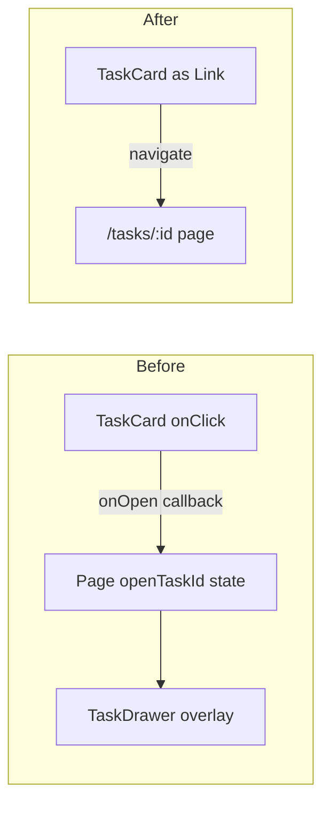

# Remove the task peek drawer; every task reference navigates to its page

> Delete `TaskDrawer.tsx` and make every place that currently opens the drawer (board cards, backlog/archive rows, project/space task rows, and blocker chips) navigate to the full task page at `/tasks/:id` instead — with cards and rows becoming real links that support ⌘-click / open-in-new-tab.

## Source

- GitHub issue: [#109 — Drawer redesign: slim to a peek or remove it](https://github.com/johnmarcampbell/fjord/issues/109)
- Decided during grilling: **remove entirely** (not "slim"). The drawer was *already* slimmed to a peek by the plan in [`docs/plans/issue-58-task-detail-page.md`](issue-58-task-detail-page.md); #109's "slim vs. remove" framing predates that, so the live decision was "keep the existing peek vs. remove it." Removal won — see ADR-0013.
- Both blockers are merged: [#91 project page](https://github.com/johnmarcampbell/fjord/issues/91) (CLOSED) and [#82 new-task page](https://github.com/johnmarcampbell/fjord/issues/82) (CLOSED). The decision is unblocked.

## Context

fjord has been moving to a *pages-first* model: full pages (`/tasks/:id`, `/tasks/new`, `/projects/:id`, `/spaces/:id`) are the primary surfaces for working with tasks. The `TaskDrawer` is a right-hand overlay that today opens when you click a task anywhere on the board or in a list. It was trimmed to a read-only "peek" (four quick-edit fields + read-only description/tags/blockers + a one-line timeline summary) with an ↗ "Open full view" button to `/tasks/:id`.

The board's sole human users always click past the peek straight to the full page, so the peek is a redundant middle layer. This plan removes it. All mutation behavior already lives in the shared [`useTaskEditor`](../../frontend/src/lib/useTaskEditor.ts) hook (consumed by both the drawer and `TaskDetail`), so nothing functional is lost — only an overlay UI.

Domain language is unchanged; "drawer" and "peek" are UI/implementation terms, not glossary terms, so [`CONTEXT.md`](../../CONTEXT.md) is not touched.

## Goals

1. `TaskDrawer.tsx` is deleted, with no remaining imports or mounts.
2. Every former drawer entry point navigates to `/tasks/:id`:
   - board cards, backlog rows, archive rows, project-page rows, space-page tree rows, and blocker chips on a task page.
3. Board cards and list rows are real `react-router` `<Link>`s, so ⌘-click / middle-click opens the task in a new tab. Click targets are unchanged (whole card / whole row) — only the destination changes (overlay → navigation).
4. Drag-to-reorder on the board still works exactly as before, with no native link-drag ghost artifact and no accidental navigation after a drag.
5. Nested action buttons (archive on a board card, unarchive on an archive row, and the ✕ remove-blocker button) still work without triggering navigation.
6. `npm run build` and `npm run typecheck` (frontend) pass; backend tests are unaffected.

## Non-goals

1. **No lightweight replacement peek** (no hover-card, popover, or modal). Removal is total; blocker chips navigate like everything else.
2. **No changes to `TaskDetail`, `TaskPage`, or `useTaskEditor` behavior** beyond removing the blocker-chip-opens-drawer wiring. The full task page is the destination, untouched.
3. **No backend, schema, API, or shared-types changes.** This is a frontend-only change.
4. **No new task-card or task-row visual redesign.** Same markup and styling; only the wrapping element (`
`/`<button>` → `<Link>`) and the click destination change.
5. **No removal of `FilterPill`, `useTimelineFilter`, `Field`, or `SectionLabel`** — all are still used by `TaskDetail` (and `NewTaskPage`) after the drawer is gone.

## Relevant prior decisions

- **ADR-0013 — Remove the task peek drawer** ([docs/adr/0013-remove-task-peek-drawer.md](../adr/0013-remove-task-peek-drawer.md)) *(new, created with this plan)*. Records the remove-not-slim decision and the rationale.
- Plan: [`issue-58-task-detail-page.md`](issue-58-task-detail-page.md) — built the `/tasks/:id` page, the shared `useTaskEditor` hook, and the slimmed drawer-as-peek this plan now removes.
- Plan: [`issue-91-project-page.md`](issue-91-project-page.md) and [`issue-82-new-task-page.md`](issue-82-new-task-page.md) — the full-page surfaces whose existence makes the drawer redundant.

## Relevant files and code

**Delete:**
- `frontend/src/components/TaskDrawer.tsx` — the entire component (and its local `buildTimelineSummary` helper).

**Leaf components that currently open the drawer (convert to self-navigating `<Link>`, drop the `onOpen` prop):**
- `frontend/src/components/TaskCard.tsx:147-191` — board card; body `
` at `:164-176` becomes a `<Link>` with `draggable={false}`. The drag preview `TaskCardOverlay` (`:193-227`) stays a `
`. The archive button at `:177-188` is a **sibling** of the body (both children of the outer `setNodeRef` div), so it's *not* inside the link — leave it as-is, no `preventDefault` needed.
- `frontend/src/components/taskList.tsx:46-74` — `TaskRow`; currently `<button onClick={onOpen}>`. Becomes a `<Link>`. Used by both the project page and the space tree.
- `frontend/src/components/BacklogView.tsx` — backlog row at `:118-174` is **itself a draggable card** (`useSortable`, same `handleProps`/`bodyProps` mobile/desktop grip split as `TaskCard`; `onClick={onOpen}` at `:160`). It has a `BacklogRowOverlay` drag preview at `:176+` (stays a `
`) and an `onPromote` action button inside `RowBody`. Threading at `:214-263`, mount prop at `:415`.
- `frontend/src/components/ArchiveView.tsx:16-83` — `ArchiveRow` (`onClick={onOpen}` at `:23`); has an unarchive button needing `e.preventDefault()`. Mount wiring at `:84`, `:160`.
- `frontend/src/components/TaskDetail.tsx:164-194` — blocker chip; `<button onClick={() => onOpenBlockerInDrawer(id)}>` at `:175-184` becomes a `<Link>`. Drop the `onOpenBlockerInDrawer` prop (`:35`, `:45`). The ✕ remove-blocker button at `:185-190` needs `e.preventDefault()` once its parent chain is a link — but here the chip *title* is the link and the ✕ is a sibling `<button>`, so verify whether `preventDefault` is needed (see Step 7).

**Prop-threading pass-throughs to clean up (remove the now-unused `onOpenTask` / `setOpenTaskId`):**
- `frontend/src/components/Board.tsx:32-34` — `setOpenTaskId` prop.
- `frontend/src/components/Column.tsx:17,27,81-88` — `onOpenTask` prop, passed to `TaskCard`.
- `frontend/src/components/SpaceProjectTree.tsx:32-37,168-172` — `onOpenTask` prop, passed to `TaskRow`.

**Pages that hold drawer state + mount the drawer (remove state, mount, and now-unused queries/props):**
- `frontend/src/pages/BoardPage.tsx:6,16,39-50` — `openTaskId` state, `TaskDrawer` mount, `setOpenTaskId` passed to `Board`/`BacklogView`/`ArchiveView`.
- `frontend/src/pages/ProjectPage.tsx:13,38,122,128-135` — `openTaskId` state, `TaskRow onOpen`, `TaskDrawer` mount.
- `frontend/src/pages/SpaceDetailPage.tsx:12,37,105,108-115` — `openTaskId` state, `SpaceProjectTree onOpenTask`, `TaskDrawer` mount.
- `frontend/src/pages/TaskPage.tsx:8,49-54,161,163-170` — `openBlockerId` state, the `allTasks` query (only used for the drawer's `allTasks` prop), `onOpenBlockerInDrawer` pass, and the `TaskDrawer` mount.

**Stays (do not touch — still used after removal):**
- `frontend/src/components/FilterPill.tsx`, `frontend/src/lib/useTimelineFilter.ts` — still used by `TaskDetail` (`TaskDetail.tsx:23,67,547-561`).
- `Field` / `SectionLabel` in `TaskDetail.tsx:384+` — still used by `TaskDetail` and `NewTaskPage`.

**Drag sensor (context for Step 1):**
- `frontend/src/components/Board.tsx:51-52` — `PointerSensor` with `activationConstraint: { distance: 6 }`. This 6px threshold is what cleanly separates a click (navigate) from a drag (reorder), so no sensor change is needed.

## Approach

The current architecture threads an `onOpen` / `onOpenTask` callback from each page down to each leaf (card/row), and each page owns an `openTaskId`/`openBlockerId` state plus a `TaskDrawer` mount. We invert this: the **leaf knows its own task id, so it self-navigates via a `<Link to={`/tasks/${id}`}>`**. That removes both the callback prop-drilling and the per-page drawer state in one sweep, and — because the leaf is now a real anchor — gives ⌘-click-to-new-tab for free.

Two mechanics matter:

1. **dnd-kit vs. native link-drag (draggable cards: board + backlog).** fjord's reordering is dnd-kit's pointer-based drag, *not* the browser's native HTML drag-and-drop. An `<a>` defaults to `draggable=true` (native link-drag, which would show a ghost-URL chip and fight dnd-kit). Setting `draggable={false}` disables *only* the native behavior; dnd-kit's pointer listeners keep working. The existing `distance: 6` activation constraint means a sub-6px press is a click (navigate) and a >6px move is a drag (reorder, trailing click suppressed by the browser) — so no extra click-suppression code is needed. **Mobile needs nothing special, and is actually the cleaner case:** `bodyProps = isMobile ? {} : {...listeners}`, so on mobile the body-link carries *no* drag listeners — dragging happens only via the separate left-hand grip, which is a sibling `
` (with `touch-action: none`) that stays a `
` and is untouched. A tap on the body navigates; a scroll gesture that starts on the body does not fire a click (native browser behavior, same as today's `onClick`). `draggable={false}` is harmless on touch and stays for the desktop case.

2. **Nested action buttons inside an anchor.** Clicking *any* descendant of an `<a>` triggers the anchor's native navigation. `stopPropagation()` (which several buttons already call) stops React's synthetic bubbling but does **not** cancel the browser's default navigation. So an action button must add `e.preventDefault()` **only if it is a DOM descendant of the link**. Because the plan converts the *body* element to the link (not the outer card container), the rule splits cleanly:
   - **Descendants → need `preventDefault`:** the backlog row's `onPromote` button (rendered inside the body via `RowBody`) and the archive row's unarchive button (inside the row's `onClick` element).
   - **Siblings → no change:** the board card's archive button (a sibling of the body, both children of the outer `setNodeRef` div) and the blocker chip's ✕ button (a sibling of the title link inside the chip ``). These already call `stopPropagation`; that stays, but no `preventDefault` is required because the click target is outside the anchor.

The work is mechanical and TypeScript-guided: removing a prop from a leaf produces compile errors at every caller, walking you up the tree. Do it surface by surface (board, then project/space, then task page), deleting the component last.

## Step-by-step plan

1. **Board card → `<Link>`.** In `frontend/src/components/TaskCard.tsx`: replace the body `
` (`:164-176`) with a `react-router-dom` `<Link to={`/tasks/${task.id}`} draggable={false} {...bodyProps}>` carrying the same className. Remove `onOpen` from `Props` (`:38`) and the destructure (`:129`). **Leave the archive button (`:177-188`) unchanged** — it's a sibling of the body, not a descendant of the new link, so it does not navigate (its existing `stopPropagation` stays). Leave `TaskCardOverlay` as a `
`. On mobile this is the trivial case: `bodyProps` is empty (drag listeners live on the separate grip), so the link carries no drag listeners at all. Verify: `frontend` typecheck flags `Column.tsx` (next step).

2. **Drop `onOpenTask` from the board column chain.** In `frontend/src/components/Column.tsx`: remove the `onOpenTask` prop (`:17,27`) and the `onOpen={() => onOpenTask(task.id)}` passed to `TaskCard` (`:88`). In `frontend/src/components/Board.tsx`: remove the `setOpenTaskId` prop (`:32-34`) and any pass-through to `ColumnView`. Verify: typecheck flags `BoardPage.tsx`.

3. **Backlog rows → `<Link>` (treat like the board card — it's draggable).** In `frontend/src/components/BacklogView.tsx`: the backlog row is a draggable card, so apply the **same** treatment as Step 1: convert the body `
` (`:158-171`) to `<Link to={`/tasks/${task.id}`} draggable={false} {...bodyProps}>`, and leave `BacklogRowOverlay` (`:176+`) as a `
`. Add `e.preventDefault()` to the `onPromote` button inside `RowBody` (it's a nested interactive element). Remove the `onOpen`/`onOpenTask` props through this file's internal components (`:47,58,125,214-263`) and the `onOpenTask={setOpenTaskId}` mount prop (`:415`).

4. **Archive rows → `<Link>`.** In `frontend/src/components/ArchiveView.tsx`: convert `ArchiveRow`'s clickable element (`onClick={onOpen}` at `:23`) to a `<Link>`, remove the `onOpen` prop (`:16,20`) and the `onOpenTask` prop on `ArchiveView` (`:84`, `:160`). Add `e.preventDefault()` to the unarchive button.

5. **BoardPage: remove drawer.** In `frontend/src/pages/BoardPage.tsx`: delete the `TaskDrawer` import (`:6`), the `openTaskId` state (`:16`), the `TaskDrawer` mount (`:43-50`), and the `setOpenTaskId`/`onOpenTask` props passed to `Board`/`BacklogView`/`ArchiveView` (`:39-41`). The `tasks` query stays only if still used; remove if it was only feeding the drawer's `allTasks`. Verify: board renders, clicking a card navigates.

6. **Shared `TaskRow` → `<Link>` (project + space).** In `frontend/src/components/taskList.tsx`: change `TaskRow` (`:46-74`) from `<button onClick={onOpen}>` to `<Link to={`/tasks/${task.id}`}>` with the same className; remove the `onOpen` prop. Then:
   - `frontend/src/components/SpaceProjectTree.tsx`: remove the `onOpenTask` prop (`:32-37`) and the `onOpen={() => onOpenTask(t.id)}` pass (`:172`).
   - `frontend/src/pages/ProjectPage.tsx`: remove the `TaskDrawer` import (`:13`), `openTaskId` state (`:38`), the `onOpen` on `TaskRow` (`:122`), and the `TaskDrawer` mount (`:128-135`).
   - `frontend/src/pages/SpaceDetailPage.tsx`: remove the `TaskDrawer` import (`:12`), `openTaskId` state (`:37`), the `onOpenTask` pass (`:105`), and the `TaskDrawer` mount (`:108-115`).

7. **Blocker chips → `<Link>` (task page).** In `frontend/src/components/TaskDetail.tsx`: change the blocker title `<button onClick={() => onOpenBlockerInDrawer(id)}>` (`:175-184`) to a `<Link to={`/tasks/${id}`}>` with the same className. Remove `onOpenBlockerInDrawer` from `TaskDetailProps` (`:35`) and the signature (`:45`). The ✕ remove-blocker button (`:185-190`) is a *sibling* of the link inside the chip ``, not a descendant of the link — confirm in-browser that clicking ✕ does not navigate; only add `e.preventDefault()` if it does. In `frontend/src/pages/TaskPage.tsx`: remove the `TaskDrawer` import (`:8`), the `openBlockerId` state (`:51`), the `allTasks` query (`:54`, only used for the drawer), the `onOpenBlockerInDrawer={setOpenBlockerId}` prop (`:161`), and the `TaskDrawer` mount (`:163-170`). Update the component doc comment (`:36-37`) that mentions hosting a drawer.

8. **Delete the component.** Remove `frontend/src/components/TaskDrawer.tsx`. Run `grep -rn "TaskDrawer" frontend/src` and confirm zero matches.

9. **Build + typecheck.** From `frontend/`, run `npm run typecheck` then `npm run build`; from root run `npm test` (backend, should be unaffected). Fix any stragglers (unused imports of `FilterPill`/`useTimelineFilter` should NOT appear — those stay in `TaskDetail`).

## Demo seed data

Not applicable — this is a frontend-only change (deleting a UI overlay and changing click destinations). No tables, columns, entity types, relationships, or API capabilities are added or changed, so `backend/demo/seed.sql` needs no update.

## Testing strategy

There are no frontend component/E2E tests in this repo (per `CLAUDE.md`), so verification is by build + typecheck + manual browser walkthrough.

- **Build/typecheck:** `npm run typecheck` and `npm run build` in `frontend/` pass clean; `npm test` (backend) at root still passes (no backend change, so this is a regression guard only).
- **Manual flows (run `npm run dev`, open the app):**
  1. **Board:** click a card → lands on `/tasks/:id`. ⌘-click (or middle-click) a card → opens the task in a **new tab**. Drag a card between columns → reorders, **no** ghost-URL artifact, and releasing the drag does **not** navigate. On a `Done` card, click the archive button → archives, **no** navigation.
  2. **Backlog view:** click a row → navigates; ⌘-click → new tab.
  3. **Archive view:** click a row → navigates to the archived task's page; click unarchive → unarchives, **no** navigation.
  4. **Project page (`/projects/:id`):** click a task row → navigates; ⌘-click → new tab.
  5. **Space page (`/spaces/:id`):** click a task in the project tree → navigates.
  6. **Task page (`/tasks/:id`):** click a blocker chip → navigates to that blocker's page; browser **Back** returns to the original task. Click the ✕ on a blocker → removes it, **no** navigation.
  7. **Global:** the drawer overlay never appears anywhere; no console errors.
- **Regression risk:** the board's drag-and-drop is the highest-risk area (it shares the click surface with navigation). The `distance: 6` activation constraint should keep click and drag cleanly separated — verify explicitly on both desktop (body is the drag handle) and a narrow/mobile viewport (the separate left grip is the drag handle, body is just the link).

## Acceptance criteria

- [ ] `frontend/src/components/TaskDrawer.tsx` is deleted; `grep -rn "TaskDrawer" frontend/src` returns nothing.
- [ ] Board cards, backlog rows, archive rows, project rows, and space-tree rows are `react-router` `<Link>`s and navigate to `/tasks/:id` on click.
- [ ] ⌘-click / middle-click on a card or row opens the task in a new tab.
- [ ] Board drag-to-reorder still works; no ghost-URL artifact; no accidental navigation after a drag.
- [ ] Archive button (Done card) and unarchive button (archive row) work without navigating.
- [ ] Blocker chips on `/tasks/:id` navigate to the blocker; the ✕ remove button still works without navigating.
- [ ] No drawer/overlay appears on any surface; no console errors.
- [ ] `FilterPill`, `useTimelineFilter`, `Field`, and `SectionLabel` are untouched and still used by `TaskDetail`/`NewTaskPage`.
- [ ] `npm run typecheck` and `npm run build` pass in `frontend/`.
- [ ] `npm test` passes from root (backend unaffected).

## Open questions

None — all design decisions were resolved during grilling:
- Remove vs. slim → **remove** (drawer is already a peek; users always go to the full view).
- Blocker chips peek vs. navigate → **navigate** (consistency; no component kept alive for one case).
- Click target → **unchanged** (whole card/row), destination swapped to navigation.
- New-tab support → **yes, both cards and rows** become `<Link>`s (card needs `draggable={false}`).
