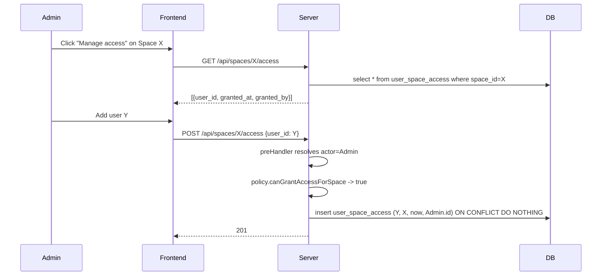

# Roles & Permissions (Admin / Member + per-Space access)

> Add a two-tier role system (`Admin` / `Member`) plus a per-Space access grants table, with server-side policy enforcement on every write endpoint and filtered visibility on every list endpoint and the SSE stream.

## Source

- GitHub issue: **#60 — Roles & permissions (Admin/User + per-space access)** — https://github.com/johnmarcampbell/fjord/issues/60
- Dependency (shipped): #56 (Spaces), #57 (Richer user profile)
- This plan refines the issue text in two notable ways resolved during grilling:
  - The non-Admin role is named **Member**, not **User**, because **User** is already the canonical term for any actor on the board (see [CONTEXT.md](../../CONTEXT.md)).
  - Space creation is **open to any User** (not Admin-only); creators become **Space Owners** of the spaces they create (see [ADR-0007](../adr/0007-open-space-creation-and-space-owner.md)).

## Context

fjord currently has no concept of permissions — every authenticated user (everyone with a valid `X-User-Id`) can do everything. This issue introduces:

- A global **Role** on each **User**: `Admin` or `Member`.
- A **Space access** grants table that lets specific Members see and act within specific Spaces. Admins implicitly access every Space; Space Owners implicitly access their own.
- Middleware that resolves the acting User on every request and decorates the request with their role and accessible Space IDs.
- A policy module that gates writes (403 when forbidden) and filters reads (silently subset).
- SSE stream filtering so Members only receive events for Spaces they can access.

The system runs in a trusted gateway (no authentication; `X-User-Id` is the only identity signal). Authorization happens server-side; the frontend hides affordances Members cannot use, but the server is the source of truth.

Domain terms used in this plan are defined in [CONTEXT.md](../../CONTEXT.md): **User**, **Role**, **Member**, **Space**, **Space access**, **Space Owner**, **Handle**, **Kind**, **Title**.

## Goals

1. Every **User** has a `role` of `Admin` or `Member`, persisted on `users.role`.
2. A **Default Administrator** user (id `default-administrator`, handle `admin`) exists on every install, is created on startup if missing, and cannot be deleted or demoted.
3. A `user_space_access` table records per-Space grants for Members, with `granted_at` and `granted_by` audit columns.
4. Every **Space** has a recorded **Space Owner** (`spaces.created_by`).
5. A Fastify `preHandler` hook resolves `X-User-Id` → User → role → accessible Space IDs on every authenticated request, decorating `req.actor`.
6. A `backend/src/auth/policy.ts` module exposes predicates (`canManageUsers`, `canManageSpace`, `canAccessSpace`, `canGrantAccessTo`, etc.); routes consult it and return **403** on denial.
7. List endpoints (`GET /api/spaces`, `GET /api/projects`, `GET /api/tasks`) filter to accessible spaces; never 403 the list.
8. SSE `task.*` events carry a `space_id` field; the `/api/events/stream` route filters per subscriber using their accessible-Spaces snapshot at connect time.
9. Cross-space task and project moves are rejected when they would orphan an assignee (assignee loses visibility of their assigned task).
10. Soft-deleted users (`deleted_at != null`) are rejected at actor resolution.
11. Frontend hides affordances Members cannot use (user CRUD beyond self, space delete/archive for non-owners, "Manage access" for non-owners/non-Admins).

## Non-goals

1. **Authentication / login.** No password flow, no token validation beyond the existing optional `Bearer` token gate. Identity is still asserted by `X-User-Id`.
2. **Per-project or per-task ACLs.** Granularity stops at Space.
3. **Multi-tier admin** (super-admin, audit-only admin, etc.). Just `Admin` / `Member`.
4. **Ownership transfer.** A Space's `created_by` is set on creation and not transferable in this issue. If the owner is soft-deleted, the row remains; Admins can still manage.
5. **Cross-space blocker restrictions.** Blockers may currently span Spaces; tightening that is out of scope.
6. **An audit-log table for grants.** The `granted_at`/`granted_by` columns on `user_space_access` are the only record.
7. **Granting access via task events.** Grants do not produce task events.
8. **MCP server permission enforcement (#63).** Blocked by this work but not part of it.

## Relevant prior decisions

- [ADR-0001](../adr/0001-defer-permissions-no-role-on-users.md) — Defer permissions / no `role_global` on users **(superseded by ADR-0005)**
- [ADR-0002](../adr/0002-user-profile-backfill-in-app-code.md) — User profile backfill in app code
- [ADR-0003](../adr/0003-user-creation-on-users-page.md) — User creation on Users page
- [ADR-0004](../adr/0004-soft-delete-users.md) — Soft delete users (interacts with grant retention; see Approach)
- [ADR-0005](../adr/0005-role-column-on-users.md) — Add `role` column to users **(new, created with this plan)**
- [ADR-0006](../adr/0006-default-administrator-user.md) — Default Administrator user **(new, created with this plan)**
- [ADR-0007](../adr/0007-open-space-creation-and-space-owner.md) — Open space creation + Space Owner **(new, created with this plan)**

## Relevant files and code

### Backend (must read)

- [`backend/src/db/schema.ts`](../../backend/src/db/schema.ts) — Drizzle schema; add `role` to `users`, `created_by` to `spaces`, new `userSpaceAccess` table
- [`backend/src/server.ts`](../../backend/src/server.ts:60) — `buildApp()`; route registration and existing `preHandler` (demo reset) at line 70
- [`backend/src/event_bus.ts`](../../backend/src/event_bus.ts) — In-memory pub/sub for SSE; publishes `StreamEvent`
- [`backend/src/routes/tasks.ts`](../../backend/src/routes/tasks.ts:40) — `ACTOR_HEADER`, `requireActor` (lines 40–74); to be replaced/refactored to consume `req.actor` from the new hook
- [`backend/src/routes/projects.ts`](../../backend/src/routes/projects.ts:17) — Duplicate `ACTOR_HEADER` / `requireActor` pattern; same refactor
- [`backend/src/routes/spaces.ts`](../../backend/src/routes/spaces.ts) — Space CRUD; soften to allow Member creation, enforce Owner/Admin on edit/archive/delete, add grants subroutes
- [`backend/src/routes/users.ts`](../../backend/src/routes/users.ts) — User CRUD; Admin-only for non-self mutations
- [`backend/src/routes/stream.ts`](../../backend/src/routes/stream.ts) — SSE handler; filter per subscriber
- [`backend/src/services/tasks.ts`](../../backend/src/services/tasks.ts:132) — `requireUser` helper; task service mutations (where assignee-orphaning check belongs)
- [`backend/src/services/users.ts`](../../backend/src/services/users.ts) — User service; add Default Administrator bootstrap and `role` handling
- [`backend/src/services/spaces.ts`](../../backend/src/services/spaces.ts) — Space service; record `created_by`
- [`backend/src/config.ts`](../../backend/src/config.ts) — Zod-validated config; no changes required for bootstrap (the Default Administrator is created unconditionally on startup)
- [`backend/migrations/`](../../backend/migrations/) — Drizzle-generated SQL migrations; new `0007_*.sql` for the schema additions
- [`backend/tests/`](../../backend/tests/) — Existing Vitest patterns (`helpers.ts`, `tasks.test.ts`, `users.test.ts`, `spaces.test.ts`)

### Shared (must read)

- [`shared/src/index.ts`](../../shared/src/index.ts:140) — `RESERVED_HANDLES`, `HANDLE_REGEX`, request/response interfaces, `StreamEvent` (line 207); add `Role`, extend `User`, `Space`, `StreamEvent`

### Frontend (must read)

- [`frontend/src/lib/api.ts`](../../frontend/src/lib/api.ts) — `fetch` wrapper, `ApiError`; reads `X-User-Id` from `user.ts`
- [`frontend/src/lib/user.ts`](../../frontend/src/lib/user.ts) — Acting user persistence in localStorage
- [`frontend/src/lib/queries.ts`](../../frontend/src/lib/queries.ts), [`mutations.ts`](../../frontend/src/lib/mutations.ts) — React Query hooks
- [`frontend/src/lib/stream.ts`](../../frontend/src/lib/stream.ts) — SSE client; update for `space_id` field if used
- [`frontend/src/components/SpaceSwitcher.tsx`](../../frontend/src/components/SpaceSwitcher.tsx), [`ManageSpacesDialog.tsx`](../../frontend/src/components/ManageSpacesDialog.tsx), [`Header.tsx`](../../frontend/src/components/Header.tsx) — Space UI; conditionally show edit/archive/delete
- [`frontend/src/components/UserPicker.tsx`](../../frontend/src/components/UserPicker.tsx), [`UserCard.tsx`](../../frontend/src/components/UserCard.tsx), [`UserFormDialog.tsx`](../../frontend/src/components/UserFormDialog.tsx) — User UI; conditional edit/delete affordances
- [`frontend/src/pages/BoardPage.tsx`](../../frontend/src/pages/BoardPage.tsx), [`UsersPage.tsx`](../../frontend/src/pages/UsersPage.tsx) — Pages; empty-state for Members with no Space access

## Approach

### Data model

Three schema changes:

1. **`users.role`** — `text("role", { enum: ["Admin", "Member"] }).notNull().default("Member")`. Migration backfills all existing rows to `Admin` (existing users had de-facto admin powers; preserving that is the least-surprising migration).
2. **`spaces.created_by`** — `text("created_by").notNull().references(() => users.id)`. Migration backfills existing spaces with `default-administrator`.
3. **`user_space_access`** — new table with composite primary key `(user_id, space_id)`, plus `granted_at` (text/ISO) and `granted_by` (FK to users.id). `ON DELETE CASCADE` on both `user_id` and `space_id`. No `id` column.

The Default Administrator (id `default-administrator`, handle `admin`, role `Admin`, kind `human`) is created at startup by a `seedDefaultAdministrator` helper called from `buildApp()` before any other seeding. It is created if missing on every startup. The reserved handle `admin` is already in `RESERVED_HANDLES` in `shared/src/index.ts:140`; we additionally enforce that only the Default Administrator may hold it.

### Actor resolution

A single Fastify `preHandler` hook in `server.ts` runs on every route except an explicit allow-list:

- Allow-listed (no auth needed): `/api/health`, `/api/auth/validate`, `/api/config`, `/api/docs/*`
- Everything else (including the SSE stream and static assets routed via `/api/`): requires resolution

The hook lives in `backend/src/auth/actor.ts` and is wired in `server.ts`. It:

1. Reads `X-User-Id`. Missing → 400 `Missing required header: X-User-Id`.
2. Looks up the user. Unknown → 400 (demo-mode auto-create is preserved).
3. Rejects soft-deleted users (`deleted_at != null`) → 400 `User has been deleted`.
4. Loads the user's `role`.
5. For Members, loads their accessible Space IDs (a single `select space_id from user_space_access where user_id = ?` + space IDs the user owns).
6. Decorates `req.actor = { id, role, accessibleSpaceIds }`, where `accessibleSpaceIds` is either the sentinel `"all"` (Admins) or a `Set<string>` (Members; includes owned + granted).

### Policy module

`backend/src/auth/policy.ts` exposes pure predicates over `req.actor` and the relevant target. No DB access; callers pre-load whatever the predicate needs.

```ts
canAccessSpace(actor, spaceId): boolean
canManageSpace(actor, space): boolean          // Owner or Admin
canGrantAccessForSpace(actor, space): boolean  // same as canManageSpace
canManageUsers(actor): boolean                 // Admin only
canEditUser(actor, targetUserId): boolean      // Admin OR self
canDeleteUser(actor, targetUserId): boolean    // Admin OR self; rejects default-administrator at a layer below
```

Routes consult these and `reply.code(403).send({ error: "Forbidden", reason })`. List endpoints filter using `actor.accessibleSpaceIds`; never 403 the list.

### SSE filtering

`StreamEvent` gains a `space_id: string` field on the four `task.*` variants (`task.created`, `task.updated`, `task.deleted`, `task.event_added`). The publisher (in `services/tasks.ts`) already has the task in scope, so this is mechanical. `demo.reset` retains no `space_id` and is broadcast.

`routes/stream.ts` reads `req.actor` (set by the hook), captures `accessibleSpaceIds` as a snapshot at connect time, and only forwards events whose `space_id` is in the snapshot (or always, if the snapshot is `"all"`). The snapshot does not refresh mid-connection; revoked Members converge on next refetch of `/api/tasks` or on reconnect.

### Cross-space move guard

In `services/tasks.ts`, when a PATCH changes `space_id` and the task has a non-null `assigned_to`:

- Compute `assigneeAccessibleSpaces` (a single query).
- If destination `space_id` is not in that set (and the assignee is not Admin and not the destination Space's owner), throw `AssigneeNoAccessError` → 400 `Assignee <handle> does not have access to destination space. Reassign or grant access first.`

Same rule for the project-move endpoint, iterating over the project's tasks.

### Soft-delete and grants

We keep `user_space_access` rows when a user is soft-deleted. They are inert because the user cannot pass actor resolution. ADR-0004's "row stays for attribution" intent extends naturally; no migration data-cleanup is needed.

### UI strategy

Hide, don't disable. A Member who is not an Admin and not a Space Owner doesn't see:

- "New user" / "Edit user X" / "Delete user X" on `/users` (for users other than self)
- "Edit space" / "Archive space" / "Delete space" on spaces they don't own
- "Manage access" on spaces they don't own
- The Default Administrator's "Delete" affordance, ever (for anyone)

Members *do* see:
- The full user directory (read-only for others, edit/delete for self)
- The "+ New space" button — anyone can create a space
- Their own spaces' management affordances
- Empty-state copy on the board when they have access to zero spaces ("You don't have access to any spaces yet. Create one with '+ New space' or ask an Admin/Space Owner for access.")

All hiding is ergonomic; the server is authoritative.

### Sequence — granting a Member access



## Step-by-step plan

Steps are ordered so each is independently testable and the tree stays buildable.

### Phase 1 — Schema and shared types

1. **Update `shared/src/index.ts` to add `Role` and extend types.** Add `export type Role = "Admin" | "Member";`. Extend the `User` interface with `role: Role`. Extend the `Space` interface with `created_by: string`. Extend the four task-related `StreamEvent` variants (`task.created`, `task.updated`, `task.deleted`, `task.event_added`) with `space_id: string`. Add `CreateGrantRequest`, `Grant` (the listed shape), `UpdateUserRequest`'s `role?` field. Run `npm run build` from `shared/` to confirm. *(File compiles; types exported.)*

2. **Update `backend/src/db/schema.ts`.** Add `role: text("role", { enum: ["Admin", "Member"] }).notNull().default("Member")` to `users`. Add `createdBy: text("created_by").notNull().default("default-administrator").references(() => users.id)` to `spaces`. Add a new `userSpaceAccess` table with composite PK `(userId, spaceId)`, `grantedAt` text NOT NULL, `grantedBy` text NOT NULL FK to users, and an index on `userId`. Both FKs on `userSpaceAccess` cascade on delete. *(Schema file edits in.)*

3. **Generate the migration.** `cd backend && npm run db:generate`. Verify a new SQL file appears (likely `0007_*.sql`). Inspect it to confirm: `ALTER TABLE users ADD COLUMN role`, `ALTER TABLE spaces ADD COLUMN created_by`, `CREATE TABLE user_space_access`. *(Migration file present and correct.)*

4. **Hand-edit the migration for backfills.** Append SQL to:
   - `UPDATE users SET role = 'Admin'` (all existing users become Admin)
   - The `created_by` default of `default-administrator` handles existing spaces, but verify the column was added with that default.
   This is the only place hand-written migration SQL is acceptable; document the reason in the file as a comment. *(Migration applies cleanly on a copy of the existing dev DB.)*

5. **Add a Vitest test for the migration.** Create or extend `backend/tests/migrations.test.ts` to: load the schema fresh, assert that running the new migration on a DB pre-seeded with old-shape rows yields `role='Admin'` for existing users and `created_by='default-administrator'` for existing spaces. *(Test passes.)*

### Phase 2 — Default Administrator bootstrap

6. **Add `seedDefaultAdministrator(dbHandle)` in `backend/src/services/users.ts`.** If no user with id `default-administrator` exists, insert: `id=default-administrator`, `display_name=Administrator`, `handle=admin`, `kind=human`, `title=Administrator`, `bio=Built-in administrator. Cannot be deleted.`, `avatar=🛡️` (or another emoji from the curated list), `token_hash=null`, `role=Admin`, `created_at=now`. Idempotent. *(Direct test in `backend/tests/users.test.ts`: call twice; second call is a no-op.)*

7. **Wire `seedDefaultAdministrator` into `buildApp()` in `backend/src/server.ts`.** Call it after `dbHandle` is created and migrations have run, *before* `seedUsers(...)` and `backfillUserProfiles(...)` (so the Default Administrator participates in those passes). *(Server starts; row present in DB.)*

8. **Guard the Default Administrator in user routes.** In `backend/src/routes/users.ts`:
   - `DELETE /api/users/default-administrator` → 400 `Cannot delete the Default Administrator`.
   - `PATCH /api/users/default-administrator` with `role` change or `handle` change → 400; other fields editable.
   The id check happens before any actor authorization (it's an invariant, not a permission). *(Tests in `users.test.ts`.)*

### Phase 3 — Actor resolution and policy

9. **Create `backend/src/auth/actor.ts`.** Export `resolveActor(req, dbHandle): Actor` and the `Actor` type. `Actor = { id: string; role: Role; accessibleSpaceIds: Set<string> | "all" }`. Implement the resolution: header check, user lookup, soft-delete check, role load, accessible-spaces load (owned + granted) for Members. Demo-mode auto-create logic from the existing `requireActor` helpers moves here. *(Pure function with unit tests in `backend/tests/auth.test.ts`.)*

10. **Register a global Fastify `preHandler` hook in `server.ts`.** The hook calls `resolveActor` and assigns to `req.actor`. Skip the allow-list URLs (`/api/health`, `/api/auth/validate`, `/api/config`, anything under `/api/docs/`). On resolution failure the hook calls `reply.code(400).send(...)` and returns to short-circuit. Use Fastify's `declare module` to add `actor?: Actor` to `FastifyRequest`. *(All routes still pass tests; no actor-resolution logic remains in `routes/tasks.ts` etc.)*

11. **Delete the per-route `requireActor` / `ACTOR_HEADER` duplication.** Remove from `routes/tasks.ts:40`, `routes/projects.ts:17`, `routes/users.ts`. Replace call sites with `req.actor!.id`. *(Tests pass; lint clean; no dead imports.)*

12. **Create `backend/src/auth/policy.ts`.** Export predicates as listed in Approach. Each is pure: takes an `Actor` and the minimum target object/IDs it needs. No DB access in this module. *(Unit tests in `backend/tests/policy.test.ts`.)*

### Phase 4 — Enforce policy on routes

13. **Enforce on user routes (`routes/users.ts`).**
    - `POST /api/users` → `policy.canManageUsers(actor)`; 403 otherwise.
    - `PATCH /api/users/:id` → `policy.canEditUser(actor, params.id)`; 403 otherwise (allows self-edit).
    - `DELETE /api/users/:id` → `policy.canDeleteUser(actor, params.id)`; 403 otherwise (allows self-delete; Default Administrator already blocked at step 8).
    - `POST /api/users` accepts and persists a `role` field. Default `Member`. Only Admins may pass this field (otherwise 400 if a non-Admin sends `role`).
    - `PATCH /api/users/:id` accepts `role` updates from Admins only; ignore (400) from non-Admins.
    *(Tests: Admin can CRUD anyone; Member can only self-edit/self-delete; non-Admin trying to set role gets 403/400.)*

14. **Enforce on space routes (`routes/spaces.ts`).**
    - `POST /api/spaces` → no role check; any User can create. Set `created_by = actor.id`. Do **not** write a `user_space_access` row for the creator — ownership is derived from `created_by` and actor resolution treats Owners' spaces as accessible without needing a grant. This keeps the grants table clean (it represents *explicit* grants only).
    - `PATCH /api/spaces/:id` → `policy.canManageSpace(actor, space)`; 403 otherwise.
    - `DELETE /api/spaces/:id` → `policy.canManageSpace(actor, space)` + existing "no tasks" invariant.
    - `POST /api/spaces/:id/archive`, `unarchive` → `policy.canManageSpace`.
    *(Tests: Members can create; Owners can edit/archive their own; Members 403 on others' spaces; Admins 200 everywhere.)*

15. **Add space grants subroutes in `routes/spaces.ts`.**
    - `GET /api/spaces/:id/access` → list grants for the space. Requires `canAccessSpace` (anyone with access can see who else has access).
    - `POST /api/spaces/:id/access` body `{ user_id }` → upsert (idempotent). `policy.canGrantAccessForSpace(actor, space)`. 400 if target user is soft-deleted (`Cannot grant access to deleted user`). 400 if target user is an Admin (`Admin already has access`).
    - `DELETE /api/spaces/:id/access/:user_id` → idempotent (200 even if no row). Same policy.
    *(Tests: Admin and Owner can grant/revoke; Member without ownership 403s; granting to soft-deleted user 400s; revoking nonexistent grant 200s.)*

16. **Filter list endpoints by `actor.accessibleSpaceIds`.**
    - `GET /api/spaces` — if `accessibleSpaceIds === "all"`, return all; else filter to that set.
    - `GET /api/projects` — same filter applied via the project's `space_id`.
    - `GET /api/tasks` — same filter; combine with the existing `include_archived` flag.
    *(Tests: Member with 2 grants sees exactly those 2 spaces' contents. Admin sees everything.)*

17. **Enforce access on task/project item endpoints.**
    - `GET /api/tasks/:id` (and the events/journal/comments subroutes), `PATCH`, `DELETE`, archive/unarchive, blocker add/remove → `policy.canAccessSpace(actor, task.space_id)`. 403 otherwise.
    - `GET /api/projects/:id`, `PATCH`, `DELETE`, move → `policy.canAccessSpace(actor, project.space_id)` (and `canAccessSpace` for the destination space on a move).
    *(Tests cover both 200 and 403 paths.)*

18. **Add cross-space-move assignee guard in `services/tasks.ts`.** When `updateTask` (or the project-move equivalent) detects a `space_id` change and the task has a non-null `assigned_to`, check whether the assignee has access to the destination space (Admin: always; Owner of dest: always; explicit grant: yes; else no). On fail throw `AssigneeNoAccessError`, mapped in routes to 400 with the message in Approach. *(Tests: cross-space move blocked when assignee lacks access; allowed when reassigned to null first or assignee granted.)*

### Phase 5 — SSE filtering

19. **Add `space_id` to task `StreamEvent`s.** Already done in Step 1 at the type layer. Now thread it through publishers in `services/tasks.ts` — every place that calls `events.publish` for `task.created` / `task.updated` / `task.deleted` / `task.event_added` includes `space_id: task.space_id`. *(Tests assert payload shape.)*

20. **Filter events at SSE subscribe time in `routes/stream.ts`.** On connection, capture `req.actor!.accessibleSpaceIds` as a snapshot. In the subscribe callback, drop events whose `space_id` is not in the snapshot (Admins always forward). `demo.reset` is always forwarded. *(Test with `app.inject` + manual SSE assertion or unit-test the filter predicate in isolation.)*

### Phase 6 — Frontend

21. **Extend the frontend `User` and `Space` shapes via shared types** (free if shared types build). Wire `currentUser.role` and current Space's `created_by` into UI state. Expose helpers `isAdmin(user)`, `isSpaceOwner(user, space)`, `canManageSpace(user, space)` in a new `frontend/src/lib/policy.ts` (mirrors the backend but read-only; never trusted for security). *(Compiles; helpers available.)*

22. **Conditionally render affordances on `/users`.**
    - `UsersPage.tsx`: hide "+ New user" tile when `!isAdmin(currentUser)`.
    - `UserCard.tsx`: hide edit/delete buttons for users other than self when `!isAdmin(currentUser)`. Always hide delete on the Default Administrator card.
    - `UserFormDialog.tsx`: show the `role` selector only when `isAdmin(currentUser)`.
    *(Manual verification: log in as a Member; verify the page allows self-edit only.)*

23. **Conditionally render affordances on space UI.**
    - `SpaceSwitcher.tsx` / `ManageSpacesDialog.tsx`: show edit/archive/delete only when `canManageSpace(currentUser, space)`. Show "Manage access" only for the same predicate.
    - Always show "+ New space" to every user.
    *(Manual verification.)*

24. **Add empty-state on `BoardPage.tsx` for Members with zero accessible spaces.** When the spaces list returns `[]` and the user is a Member, render: "You don't have access to any spaces yet. Create one with **+ New space** or ask an Admin / Space Owner for access." *(Manual verification: create a fresh Member with no grants; the board renders the empty state.)*

25. **Update API error handling.** In `frontend/src/lib/api.ts` (or wherever `ApiError` is mapped to user-visible text), surface 403 errors with a clear "You don't have permission to do that" toast; surface the assignee-orphaning 400 with its server-provided message. *(Manual verification by force-curling endpoints from devtools.)*

26. **Manage-access UI.** Add a small dialog reachable from a Space's settings menu: lists current grants (user, granted_at, granted_by) and allows adding/removing. Reuse `Combobox.tsx` for user selection. Hidden from anyone but Admin/Owner. *(Manual verification.)*

### Phase 7 — Docs and cleanup

27. **Update [`CLAUDE.md`](../../CLAUDE.md) "API overview" section.** Add the new endpoints (`/api/spaces/:id/access*`), note role/access semantics in "Gotchas for agents", reference the new ADRs. Update the "Users" section to mention `role` and the Default Administrator. Update the "Spaces" section to mention `created_by`. *(Manual review.)*

28. **Mark ADR-0001 as superseded.** Add a single-line frontmatter or footer to `docs/adr/0001-defer-permissions-no-role-on-users.md`: `Superseded by ADR-0005.` *(Single-line edit.)*

## Testing strategy

### Backend unit tests

- **`backend/tests/auth.test.ts`** *(new)* — actor resolution: missing header, unknown user, soft-deleted user, role loading, accessible-spaces loading (Admin: `"all"`; Member with owned + granted spaces: correct set).
- **`backend/tests/policy.test.ts`** *(new)* — every predicate, all branches. Pure function tests.
- **`backend/tests/migrations.test.ts`** *(extend)* — assert backfill behavior (existing users → Admin; existing spaces → `default-administrator` owner).
- **`backend/tests/users.test.ts`** *(extend)* — Default Administrator bootstrap idempotency; protection against delete/demote/handle-change; `POST /api/users` honors and rejects `role` per actor role; Members can self-edit but not edit others (403); Admins can edit anyone.
- **`backend/tests/spaces.test.ts`** *(extend)* — Member can create; creator becomes Owner; Owner can manage own space; Members 403 on others' spaces; Admins manage anything; grants subroutes (POST/DELETE idempotency, 400 on deleted user, 400 on Admin target).
- **`backend/tests/tasks.test.ts`** *(extend)* — list filtering for Members; 403 on items in inaccessible spaces; cross-space move blocked by assignee-orphan check; project move iterates tasks correctly.
- **SSE filtering** — assert the filter function in isolation; assert that `StreamEvent` payloads include `space_id`.

### Frontend manual checks

There are no component or E2E tests in this repo. Walk through these in the browser with `npm run dev`:

1. As `default-administrator`: confirm user CRUD works, space CRUD works on all spaces, manage-access works.
2. Create a new Member, log in as them (switch via `UserPicker`):
   - `/` shows the empty-state.
   - Click "+ New space" — succeeds, you become Owner, board shows the new space.
   - Edit/archive your own space — works. Try to edit another space (URL-juggle or pick from switcher if visible) — 403.
   - `/users` — you can edit your own card; "+ New user" tile is hidden; other users' edit/delete are hidden.
3. As Admin again, grant the Member access to the `default` space; confirm the Member can now see the default space.
4. As Member, try to PATCH a task to move it to an inaccessible space — the assignee-orphan guard fires if assignee doesn't have destination access.
5. Open two browser windows (Admin + Member). Trigger a task mutation in a space the Member can access — SSE event arrives. Trigger one in a space the Member can't access — Member's SSE does not receive it (verify in devtools network panel).
6. Try to delete the Default Administrator from the UI — affordance hidden. Try via `curl -X DELETE /api/users/default-administrator` — 400.

### Regression risk

- Existing tests must continue to pass. Particular attention to `tasks.test.ts` and `spaces.test.ts`, which exercise the routes that now have new policy checks. Tests that assume an "anyone can edit" world need their actor set to an Admin (or the Owner) to keep working.
- The demo-mode auto-create flow (in `requireActor`) must survive the migration into `resolveActor` — there's an existing test path for it.

## Acceptance criteria

- [ ] `users.role` column exists and is populated for all users (`Admin` for pre-existing rows, `Member` default for new ones).
- [ ] `spaces.created_by` column exists; existing spaces backfilled to `default-administrator`.
- [ ] `user_space_access` table exists with the documented shape.
- [ ] Default Administrator user exists with id `default-administrator`, handle `admin`, role `Admin`. `DELETE` returns 400. `PATCH role` / `PATCH handle` returns 400.
- [ ] Global `preHandler` hook resolves `req.actor` on every non-allow-listed route. Missing/unknown/soft-deleted users 400.
- [ ] `backend/src/auth/policy.ts` exists and is the only place authorization rules live.
- [ ] Members 403 on user CRUD (except self), space CRUD on non-owned spaces, grant management on non-owned spaces.
- [ ] Members can create spaces; the creator becomes the Space Owner and can manage that space.
- [ ] List endpoints filter to accessible spaces for Members; Admins see everything.
- [ ] Cross-space task or project moves that would orphan an assignee return 400 with the documented message.
- [ ] SSE `task.*` events include `space_id`; subscribers receive only events for their accessible spaces (snapshot at connect).
- [ ] Frontend hides affordances Members cannot use (user CRUD beyond self, non-owned space management, "Manage access" on non-owned spaces); always shows "+ New space".
- [ ] Empty-state copy renders for Members with zero accessible spaces.
- [ ] ADR-0001 marked superseded.
- [ ] CLAUDE.md updated for new endpoints / gotchas.
- [ ] `npm test` passes from root.
- [ ] `npm run typecheck` passes in both `backend/` and `frontend/`.

## Open questions

- **Q: Should `granted_by` ever be set to `default-administrator` for Owner-implicit access?** No — Owner access isn't a grant row, it's derived. `granted_by` only appears on explicit grant rows.
- **Q: How does this interact with the planned MCP server (#63)?** Out of scope for this plan, but the MCP server will need to either accept an `X-User-Id` per tool invocation or maintain its own actor. Flagging here so the MCP plan accounts for it.
- **Q: Should an Admin be able to *demote* themselves?** Not protected by the Default Administrator invariant if they're not the Default Administrator. The implicit answer is yes; if you want this blocked, add a check ("cannot demote yourself"). Default: allow. Flag for review during implementation.

## Out-of-band work

- A small behavior change is folded into this plan: soft-deleted users are now rejected at actor resolution (previously they could still act). This is a tiny but observable change; mention in the PR description.
- ADR-0001 is being superseded — link to ADR-0005 in the PR description and the ADR footer.
- After merge, file a follow-up issue to consider: (a) cross-space blocker constraints, (b) Space ownership transfer, (c) audit logging beyond `granted_at`/`granted_by`.
