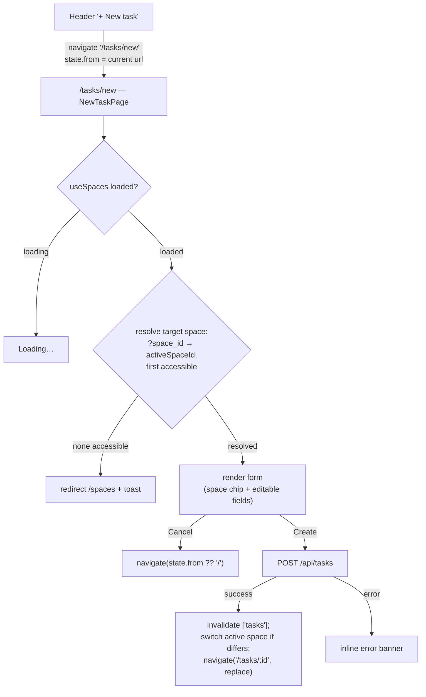

# Implementation plan — Issue #82: New-task page (`/tasks/new`)

> Replace the cramped `+ New task` modal (`NewTaskDialog`) with a full-page task-creation surface at `/tasks/new`, styled like the existing `/tasks/:id` detail page, that POSTs once and redirects to the created task.

## Source

- GitHub issue: [#82 — Revamp the new task flow in the UI](https://github.com/johnmarcampbell/agentic_kanban/issues/82)
- Blocked-by [#91 — Project page (`/projects/:id`)](https://github.com/johnmarcampbell/agentic_kanban/issues/91) — **CLOSED / landed** (commit `d8f8c18`). It settled the row-style page shell and design language this page reuses. The blocker is cleared.
- Blocks [#109 — Drawer redesign: slim to a peek or remove it](https://github.com/johnmarcampbell/agentic_kanban/issues/109) — out of scope here; #109 decides the drawer's fate only after this page lands.
- Direct precedent: [docs/plans/issue-58-task-detail-page.md](issue-58-task-detail-page.md), which created `TaskDetail`, `useTaskEditor`, and `TaskPage` and established the `pages/` + `PageShell` idiom this plan builds on.

## Context

Today the only way to create a task is the header `+ New task` button. It opens [`NewTaskDialog`](../../frontend/src/components/NewTaskDialog.tsx) — a centered modal with just **title** + **description**. The modal disappears the moment you switch context, can't surface the full field set (assignee, due date, project, tags, status) without becoming overwhelming, and is a different UI shell from the `/tasks/:id` page you use to *edit* a task. The issue's goal: one surface to learn, with the URL as state (shareable, bookmarkable, survives navigation).

The plan is **UI-only**. The backend already accepts everything we need: `POST /api/tasks` takes `title, description, column, assigned_to, due_at, project_id, space_id, tags` (see [`CreateTaskRequest`](../../shared/src/index.ts), line 325) and sets `reported_by` to the authenticated actor server-side. No new tables, columns, endpoints, or API capabilities.

Domain terms used here (**Task**, **Column**, **Space**, **Project**, **Space access**, **Space Owner**) are defined in [CONTEXT.md](../../CONTEXT.md) — **no new domain terms are introduced**. "Draft" is deliberately *not* a domain concept: the create form holds buffered local state in the browser and persists nothing until the user hits Create. Persistent autosave / draft recovery is explicitly out of scope (issue "Out of scope").

## Goals

1. New route `/tasks/new` renders a full-page, empty task-creation form using the same page shell and design language as `/tasks/:id`.
2. The header `+ New task` button **navigates** to `/tasks/new` instead of opening a modal.
3. Saving POSTs a `CreateTaskRequest`, then redirects to `/tasks/:id` of the new record (replacing the `/tasks/new` history entry).
4. The form pre-fills initial context from query params (`?column=…&project_id=…&space_id=…`) where present, and falls back to sensible defaults otherwise. All pre-filled fields stay editable.
5. The target **Space** is resolved to one the actor can actually post to; if none can be resolved, the user is redirected to the spaces page with an explanatory toast.
6. Cancel (and browser-back) returns the user where they came from, defaulting to `/`.
7. `NewTaskDialog.tsx` is deleted, along with the `creating` / `onCloseCreating` plumbing that threaded it through `App` → `BoardPage`. No remaining imports of it.
8. `npm run build` and `npm test` pass.

## Non-goals

1. **No draft mode in `TaskDetail`.** Resolved during grilling: the create surface is a **separate** `pages/NewTaskPage.tsx`, not a no-task branch inside [`TaskDetail`](../../frontend/src/components/TaskDetail.tsx). See "Approach → Why a separate page".
2. **No editable Space picker on the form.** Space renders as a **read-only context chip**. To create in a different space, the user switches via the header space switcher. (The issue says space "remains editable in the form"; grilling chose the simpler read-only chip to avoid a second space-selection surface competing with the header switcher and the assignee/project re-scoping it would require.)
3. **No persistent autosave / draft recovery.** Per the issue's "Out of scope". Navigating away loses the in-progress form.
4. **No drawer changes.** The `TaskDrawer` is untouched; its fate is issue #109.
5. **No blockers / comments / journal at creation.** `CreateTaskRequest` doesn't support them, and they're meaningless before the task exists. They're added after creation on `/tasks/:id`.
6. **No per-column `+` buttons.** The issue mentions "board column headers, backlog view" call sites, but **those don't exist today** — the header button is the only entry point. The form *reads* `?column=` / `?project_id=` so future per-column buttons can deep-link, but this plan adds no new buttons.
7. **No backend changes.** Existing `POST /api/tasks` is sufficient.
8. **No demo seed changes.** UI-only; the existing seed already exercises tasks across spaces/projects.
9. **No component / E2E tests.** Per repo convention; manual verification only.

## Relevant prior decisions

- [docs/plans/issue-58-task-detail-page.md](issue-58-task-detail-page.md) — created `TaskDetail` (presentational, exports `Field` / `SectionLabel` / `TagInput`), `useTaskEditor`, and `TaskPage`. Established `pages/<Thing>Page.tsx` for routes and the `PageShell` (`max-w-[880px]` centered) + two-column layout idiom this page reuses. Also established the principle that a deep-linked task page does **not** auto-switch active space.
- [ADR-0003 — User creation on the /users page](../adr/0003-user-creation-on-users-page.md) — precedent for moving a creation flow off a header/modal onto a page surface.
- [ADR-0012 — Space access carries affiliation, not just permission](../adr/0012-space-access-carries-affiliation-not-just-permission.md) — defines who appears in a space's member/assignee list. The assignee picker reuses `TaskDetail`'s `assignableUsers` derivation (space owner + grant rows), so it inherits this correctly.
- [CONTEXT.md](../../CONTEXT.md) — domain glossary; **no new terms** added by this plan.
- **No new ADR.** Every decision here (separate page vs. draft mode, read-only space chip, switch-active-space-on-create) is a reversible UI choice — not hard to reverse, not surprising enough to need a recorded rationale. One mild deviation worth flagging inline: this page **does** switch the active space on create (see Approach), where issue-58 chose never to auto-switch on the *detail* page. The contexts differ (you just chose where to put a new task vs. you followed a deep link to an existing one), and either is a one-line change, so no ADR.

## Relevant files and code

Read these before editing:

- [frontend/src/components/NewTaskDialog.tsx](../../frontend/src/components/NewTaskDialog.tsx) — **to delete.** Source of the current title/description create flow; note its `api.createTask({ ..., space_id: activeSpaceId })` + `invalidateQueries(["tasks"])` pattern, which the page reuses.
- [frontend/src/components/TaskDetail.tsx](../../frontend/src/components/TaskDetail.tsx) — **reference, not modified.** Exports `Field` (line 416), `SectionLabel` (line 400), `TagInput` (line 433). The right-column metadata block (Status/Assignee/Due/Project/Tags, lines 240–319), the description edit/preview toggle (lines 113–163), and the `assignableUsers` derivation (lines 49–55) are the visual + logical templates to copy into `NewTaskPage`.
- [frontend/src/pages/TaskPage.tsx](../../frontend/src/pages/TaskPage.tsx) — **reference, not modified.** Copy its `PageShell` (lines 10–16), `BackLink` (lines 18–27), `document.title` effect (lines 57–64), and error-card idiom.
- [frontend/src/pages/BoardPage.tsx](../../frontend/src/pages/BoardPage.tsx) — **modify.** Remove the `creating` / `onCloseCreating` props and the `<NewTaskDialog>` mount (lines 13–19, 50–55) plus the `NewTaskDialog` import (line 6).
- [frontend/src/App.tsx](../../frontend/src/App.tsx) — **modify.** Remove `creating` state (line 51) and rewrite `onNewTask` (lines 72–75) to navigate to `/tasks/new` carrying the referrer in `location.state`. Add the `<Route path="/tasks/new">` (near line 96). Drop the `creating` / `onCloseCreating` props passed to `<BoardPage>` (lines 88–90).
- [frontend/src/components/Header.tsx](../../frontend/src/components/Header.tsx) — **reference, likely unchanged.** Keeps its `onNewTask: () => void` prop (line 38); only `App`'s implementation of that callback changes. The button is at line 131.
- [frontend/src/lib/SpaceContext.tsx](../../frontend/src/lib/SpaceContext.tsx) — `useActiveSpace()` provides `{ activeSpaceId, activeSpace, spaces, setActiveSpaceId }`. `setActiveSpaceId` (lines 38–48) persists to localStorage and invalidates `["tasks"]` / `["projects"]` / `["archived-tasks"]`.
- [frontend/src/lib/queries.ts](../../frontend/src/lib/queries.ts) — `useSpaces()` (line 4, returns **accessible** spaces — all for Admins, owned+granted for Members), `useUsers()` (19), `useProjects(spaceId)` (23), `useSpace(spaceId)` (53), `useSpaceAccess(spaceId)` (61).
- [frontend/src/lib/mutations.ts](../../frontend/src/lib/mutations.ts) — **modify (small add).** Has `useUpdateTask`, `useDeleteTask`, etc., but **no `useCreateTask`**. Add a thin one (see Step 1).
- [frontend/src/lib/api.ts](../../frontend/src/lib/api.ts) — `createTask(body: CreateTaskRequest)` at line 136. No change.
- [frontend/src/components/DateTimePicker.tsx](../../frontend/src/components/DateTimePicker.tsx), [frontend/src/components/Combobox.tsx](../../frontend/src/components/Combobox.tsx) — leaf inputs reused by the form (DateTimePicker for Due).
- [shared/src/index.ts](../../shared/src/index.ts) — `CreateTaskRequest` (line 325), `COLUMNS`, `DEFAULT_SPACE_ID = "default"` (line 44).
- [CLAUDE.md](../../CLAUDE.md) — "Frontend architecture → Routes" subsection gets a new `/tasks/new` bullet.

## Approach

### Why a separate page (not a draft mode in `TaskDetail`)

`TaskDetail` is bound to `useTaskEditor(taskId)`: every field change PATCHes immediately (save-on-blur) under optimistic-concurrency `version` checks, and it renders blockers, the event timeline, and archive/delete — all of which require a *persisted* task. A create form is the inverse: **buffered local state, a single POST, no version, no server-only sections.** Bolting a no-task branch onto a 395-line component (and onto `useTaskEditor`) would thread two incompatible mutation models through shared code — exactly the "refactor sprawls" risk the issue anticipates.

So we build [`frontend/src/pages/NewTaskPage.tsx`](../../frontend/src/pages/NewTaskPage.tsx) as a sibling that **reuses the small, already-exported presentational pieces** (`Field`, `SectionLabel`, `TagInput`) and copies the `PageShell` / two-column layout. `TaskDetail` and `useTaskEditor` stay untouched. The visual result matches `/tasks/:id`; the data flow is independent and simple.

### Field set

Visible & editable (all held in local React state until Create):

| Field | Control | Default | Notes |
|---|---|---|---|
| Title | large `<input>` (text-2xl), `autoFocus` | `""` | Required; Create disabled until non-empty. |
| Description | `<textarea>` with **edit/preview toggle** | `""` | Same edit↔preview affordance as `TaskDetail` (lines 113–163): toggle renders local `draftDesc` either as a monospace textarea or a `<Markdown>` preview. No save button — value is submitted with the form. |
| Status (Column) | `<select>` over `COLUMNS` | `?column=` else `Backlog` | Backlog is the POST default; the dropdown lets the user pick any of the five columns at creation. |
| Assigned to | `<select>` | `— unassigned —` | Options = the **target space's** affiliated users (reuse `TaskDetail`'s `assignableUsers`: `space.created_by` + `useSpaceAccess(targetSpaceId)` grants, minus deleted users). |
| Due | `DateTimePicker` | empty | |
| Project | `<select>` | `?project_id=` else none | Options = `useProjects(targetSpaceId)`. |
| Tags | `TagInput` | `[]` | Suggestions from existing tags in the target space's task list (`useTasks(targetSpaceId)`), mirroring `TaskDetail`. |

Shown read-only: **Space** as a context chip ("Creating in **&lt;Space name&gt;**"). Hidden entirely: **Reporter** (server sets `reported_by` to the current actor), **Blockers**, **Timeline / comments / journal**, **Archive / Delete**, **version**.

### Space resolution

The form must commit to exactly one target space before rendering the assignee/project pickers (they scope to it). Resolution, computed once `useSpaces()` has loaded:

1. Candidate order: `?space_id=` query param, then `activeSpaceId` from `useActiveSpace()`.
2. Pick the **first candidate that exists in `useSpaces()`** (the accessible list — see `queries.ts:4`). This guarantees the eventual POST targets a space the actor can post to (a Member with a stale/inaccessible `?space_id=` won't get a late 403).
3. If neither candidate is accessible (invalid param **and** inaccessible active space, or the actor has **zero** accessible spaces), `useEffect` → `navigate("/spaces", { replace: true })` and `toast("Pick a space to create a task in.")`. While `useSpaces()` is still loading, render a "Loading…" shell.

### Cancel / referrer

Entry points navigate with `state: { from: location.pathname + location.search }`. Cancel calls `navigate(state?.from ?? "/")`. Browser-back works natively for the in-app case. On a cold load / refresh / bookmark there's no `state`, so Cancel falls back to `/` — exactly the issue's "default to `/` if none".

### Save

A thin `useCreateTask` mutation (added to `mutations.ts` for consistency with the other task mutations) wraps `api.createTask` and invalidates `["tasks"]` on success — the same cache invalidation the dialog does today. The **page** owns the post-success navigation in the mutation's `onSuccess`:

1. If the target space differs from the current `activeSpaceId`, call `setActiveSpaceId(targetSpaceId)` so that when the user later returns to the board they're in the space their new task lives in (and it's visible). (`setActiveSpaceId` already invalidates the relevant list queries.)
2. `navigate(\`/tasks/\${created.id}\`, { replace: true })` — `replace` drops the now-stale empty `/tasks/new` entry so browser-back from the new task lands on the original referrer, not the empty form.

POST failures surface inline (an error banner above the form, matching the dialog's `create.isError` block).

### Flow



## Step-by-step plan

1. **Add `useCreateTask` to [frontend/src/lib/mutations.ts](../../frontend/src/lib/mutations.ts).** A thin mutation hook mirroring the existing ones: `mutationFn: (body: CreateTaskRequest) => api.createTask(body)`, `onSuccess: () => queryClient.invalidateQueries({ queryKey: ["tasks"] })`. Accept an `options?: { onSuccess?: (task: Task) => void }` so the page can run navigation after the cache is invalidated (follow the shape of `useDeleteTask` / `useArchiveTask` in the same file). Verify: `cd frontend && npm run typecheck`.

2. **Create [frontend/src/pages/NewTaskPage.tsx](../../frontend/src/pages/NewTaskPage.tsx).** The route component:
   - Read query params via `useSearchParams()`: `column`, `project_id`, `space_id`.
   - Read `location.state?.from` (typed loosely as `{ from?: string }`).
   - `const { activeSpaceId, spaces, setActiveSpaceId } = useActiveSpace();` and `const { data: accessibleSpaces = [], isLoading: spacesLoading } = useSpaces();` (or reuse `spaces` from context — pick whichever is already populated; `useActiveSpace().spaces` comes from `useSpaces()` so they're the same query).
   - **Resolve target space** per "Approach → Space resolution". Put the redirect-on-failure in a `useEffect` (don't navigate during render). While `spacesLoading`, render the `PageShell` + "Loading…".
   - Local state: `title`, `draftDesc`, `editingDesc` (bool), `column` (init `?column=` if a valid `Column` else `"Backlog"`), `assignedTo` (`string | null`, init `null`), `dueAt` (`string | null`), `projectId` (`string | null`, init `?project_id=` if present), `tags` (`string[]`).
   - Data for pickers, scoped to the resolved target space: `useSpace(targetSpaceId)`, `useSpaceAccess(targetSpaceId)`, `useUsers()`, `useProjects(targetSpaceId)`, `useTasks(targetSpaceId)` (for tag suggestions). Derive `assignableUsers` exactly as `TaskDetail` does (lines 49–55).
   - `const create = useCreateTask({ onSuccess: (task) => { if (targetSpaceId !== activeSpaceId) setActiveSpaceId(targetSpaceId); navigate(\`/tasks/\${task.id}\`, { replace: true }); } });`
   - Render inside `PageShell` (copied from `TaskPage`): a top bar with a Cancel/"← Back" affordance (`onClick={() => navigate(state?.from ?? "/")}`), the read-only space chip, then the two-column grid — left: Title (large input), Description (edit/preview toggle over `draftDesc`); right (`Field` wrappers): Status `<select>`, Assigned-to `<select>`, Due `DateTimePicker`, Project `<select>`, Tags `TagInput`. A primary **Create task** button (disabled when `!title.trim() || create.isPending`) and a **Cancel** button. An inline error banner when `create.isError`.
   - On submit: `create.mutate({ title: title.trim(), description: draftDesc, column, assigned_to: assignedTo, due_at: dueAt, project_id: projectId, space_id: targetSpaceId, tags })`.
   - `document.title = "New task · agentic-kanban"` in a `useEffect`, restored on unmount (copy `TaskPage` lines 57–64).
   - Import `Field`, `SectionLabel`, `TagInput` from `../components/TaskDetail.js`.

   Verify: `cd frontend && npm run typecheck`.

3. **Wire the route in [frontend/src/App.tsx](../../frontend/src/App.tsx).** Add `<Route path="/tasks/new" element={<NewTaskPage />} />` **before** `<Route path="/tasks/:id" …>` (react-router v6 ranks static segments above dynamic ones, so order isn't strictly required, but place it first for clarity) and before the catch-all. Import `NewTaskPage`. Verify: `cd frontend && npm run typecheck`.

4. **Rewrite `onNewTask` in [frontend/src/App.tsx](../../frontend/src/App.tsx).** Replace the body (lines 72–75) with `navigate("/tasks/new", { state: { from: location.pathname + location.search } })`. Remove the `const [creating, setCreating] = useState(false)` line and stop passing `creating` / `onCloseCreating` to `<BoardPage>` (it becomes `<BoardPage />`). Keep `Header`'s `onNewTask` prop as-is. Verify: typecheck (will fail until Step 5 updates `BoardPage`'s props — do 4 and 5 together).

5. **Strip the dialog from [frontend/src/pages/BoardPage.tsx](../../frontend/src/pages/BoardPage.tsx).** Remove the `creating` / `onCloseCreating` props from the component signature (lines 13–19), delete the `{creating && <NewTaskDialog … />}` block (lines 50–55), and remove the `NewTaskDialog` import (line 6). Verify: `cd frontend && npm run typecheck`.

6. **Delete [frontend/src/components/NewTaskDialog.tsx](../../frontend/src/components/NewTaskDialog.tsx).** Confirm no remaining imports: `grep -rn "NewTaskDialog" frontend/src` returns nothing. Verify: `cd frontend && npm run typecheck && npm run build`.

7. **Update [CLAUDE.md](../../CLAUDE.md).** Under "Frontend architecture → Routes", add a bullet:
   ```
   - `/tasks/new` — full-page task creation; the `+ New task` button navigates here. Resolves a target space (query param → active space → first accessible), POSTs a `CreateTaskRequest`, and redirects to `/tasks/:id` of the new task. Replaced the old `NewTaskDialog` modal.
   ```
   Also update the `NewTaskDialog` mention earlier in the file (the "Key components" list under Frontend architecture references it — remove or repoint that line to `NewTaskPage`).

8. **Manual verification & pre-PR checks.** Run the flows in "Testing strategy", then the pre-PR commands in "Acceptance criteria".

## Demo seed data

**No seed changes.** This is a UI-only change that reuses the existing `POST /api/tasks` endpoint — no new tables, columns, entity types, relationships, or API capabilities. The existing [backend/demo/seed.sql](../../backend/demo/seed.sql) already seeds tasks across multiple spaces and projects, which is enough to exercise the new form's space chip, project picker, and assignee scoping.

## Testing strategy

**No new automated tests** — per repo convention (no component/E2E tests; no backend changes). Backend tests must still pass (regression only).

**Manual verification (`npm run dev`):**

1. **Happy path.** Header `+ New task` → lands on `/tasks/new`. Title autofocused. Space chip shows the active space's name. Fill title, description (toggle edit↔preview, confirm markdown renders), pick a non-Backlog status, assignee, due date, project, a couple of tags → **Create task** → redirects to `/tasks/:id` showing exactly those values. The new task appears on the board.
2. **Title required.** Create button disabled until title is non-empty.
3. **Cancel returns to referrer.** From the board, `+ New task` → Cancel → back on `/`. From a space page (`/spaces/:id`), `+ New task` → Cancel → back on that space page. Browser-back behaves the same.
4. **Pre-fill via query params.** Visit `/tasks/new?column=In%20Progress&project_id=<id>&space_id=<id>` directly → status, project, and space chip reflect the params; all remain editable.
5. **Space switch on create.** With active space A, visit `/tasks/new?space_id=<B>` for an accessible space B, create a task → after redirect, the header space switcher shows **B**; navigating to the board shows the task.
6. **Assignee scoping.** The assignee dropdown lists only the target space's affiliated users (space owner + granted), not all users.
7. **Can't-infer redirect.** As a Member, visit `/tasks/new?space_id=<a-space-you-can't-access>` (and with that not being your active space) → redirected to `/spaces` with a toast. As a brand-new user with zero accessible spaces, `+ New task` → same redirect.
8. **Inline error.** Force a POST failure (e.g. temporarily point at an invalid space) → error banner shows above the form; the form's input is preserved.
9. **No dialog anywhere.** `grep -rn "NewTaskDialog" frontend/src` is empty; the old modal never appears.
10. **Regression — board & detail.** Board drag/drop, opening the drawer, and `/tasks/:id` editing all still work.

**Pre-PR checks (per the standing workflow):**

```bash
npm test                                    # backend tests (no backend changes — regression)
cd backend && npm run typecheck && cd ..
cd frontend && npm run typecheck && cd ..
npm run build                               # full monorepo build
docker build -t agentic-kanban .            # production image
```

## Acceptance criteria

- [ ] Branch created from `main` before any commits (e.g. `feat/issue-82-new-task-page`).
- [ ] `frontend/src/pages/NewTaskPage.tsx` exists; renders the empty form using `PageShell` + the two-column layout and reusing `Field` / `SectionLabel` / `TagInput` from `TaskDetail`.
- [ ] `frontend/src/lib/mutations.ts` exports `useCreateTask` (invalidates `["tasks"]`, exposes `onSuccess(task)`).
- [ ] `<Route path="/tasks/new" element={<NewTaskPage />} />` is wired in `App.tsx` before `/tasks/:id` and the catch-all.
- [ ] Header `+ New task` navigates to `/tasks/new` carrying the referrer in `location.state`.
- [ ] Form fields: Title (required), Description (edit/preview), Status (defaults Backlog, all five columns selectable), Assignee (scoped to target space), Due, Project (scoped to target space), Tags. Space shown as a read-only chip. Reporter / blockers / timeline / archive / delete / version are absent.
- [ ] Target space resolves to query-param → active space → first accessible; redirects to `/spaces` with a toast when none is accessible.
- [ ] Pre-fill via `?column=…&project_id=…&space_id=…` works and stays editable.
- [ ] Save POSTs `CreateTaskRequest`, invalidates `["tasks"]`, switches active space if the target differs, and redirects to `/tasks/:id` with history `replace`.
- [ ] Cancel / browser-back returns to the referrer, defaulting to `/`.
- [ ] `NewTaskDialog.tsx` is deleted; `grep -rn "NewTaskDialog" frontend/src` returns nothing; `creating` / `onCloseCreating` plumbing removed from `App.tsx` and `BoardPage.tsx`.
- [ ] `CLAUDE.md` Routes section documents `/tasks/new`; the stale `NewTaskDialog` reference is removed/repointed.
- [ ] No backend changes; no demo seed changes.
- [ ] `npm test` passes from root.
- [ ] `npm run typecheck` passes in both `backend/` and `frontend/`.
- [ ] `npm run build` succeeds; `docker build -t agentic-kanban .` succeeds.
- [ ] PR body contains "Resolves #82".

## Open questions

None — all design decisions resolved during grilling.

## Out-of-band work

- **Issue #109 (drawer redesign)** is unblocked once this lands — it's the last of the three full-page surfaces (detail page #58, project page #91, this). Not part of this plan.
- **Future per-column / per-project `+` buttons** can deep-link into this page via the `?column=` / `?project_id=` / `?space_id=` params the form already reads. Adding such buttons is a separate, additive change.
