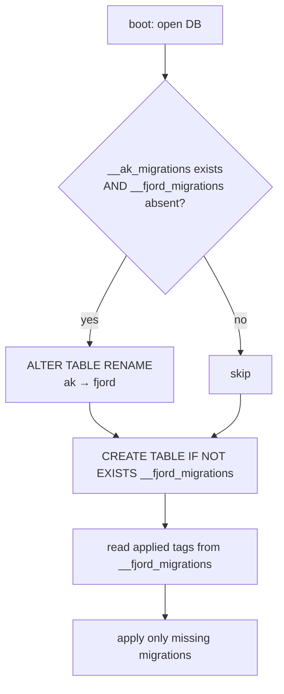

# Rename the project to "fjord"

> Rebrand the project formerly known as **agentic-kanban** to its new name **Fjord** — across code, packages, infrastructure, credentials, docs, and a documented one-time operational cutover.

## Source

- Conversation request: "rename this project from agentic_kanban to its new codename, fjord." (No durable issue/doc — this plan is the durable source. The scope below was settled in a grilling session; the decisions are recorded under *Approach*.)

## Context

The project is currently named **agentic-kanban** (a small Kanban board for humans + agents, deployed alongside Openclaw). The name appears in many spellings and layers, from cosmetic wordmarks to protocol/storage contracts. The owner has decided on a **full rebrand to Fjord** — not a hidden internal codename. Users should see "Fjord" everywhere.

Deployments with persisted state exist, but a **one-time cutover disruption is acceptable**: users re-login, operators re-set environment variables, the database file is renamed/re-pointed, and existing API tokens are re-issued. No *permanent* backward-compatibility aliases are required — but the cutover steps must be written down so nothing silently breaks.

Domain terms (User, API token, Session, etc.) are defined in [CONTEXT.md](../../CONTEXT.md). This rename touches a few of them by spelling only (the `Authorization: Bearer ak_...` examples and the project name in the CONTEXT.md header); it does **not** change any domain concept or relationship.

## Goals

1. Every user-visible surface reads **Fjord** (wordmark, login heading, OpenAPI title, browser tab titles).
2. Internal identifiers — npm package scope, CSRF magic value, reserved handle, env var prefix, default DB filename, credential prefixes, the migration-ledger table, and client storage keys — carry the new name.
3. Existing databases survive the rename: stored tasks/comments/users persist, and the migration ledger is carried over (not re-run).
4. All living and historical docs are consistent (`README.md`, `CONTEXT.md`, `CLAUDE.md`, every `docs/plans/*.md`, every `docs/adr/*.md`).
5. `npm test` and `npm run typecheck` pass; a dev run shows "Fjord" end-to-end with a `fjord_session` cookie and `fjord_...` tokens.
6. The manual cutover (folder rename, GitHub repo rename, ops re-config, token re-issue) is documented as an explicit checklist.

## Non-goals

1. **No permanent backward-compatibility shims.** We do *not* keep `KANBAN_*` env aliases, accept old `ak_` tokens, or honor the old `ak_session` cookie. The single exception is a *one-shot* guarded rename of the migration-ledger table (so existing DBs keep their ledger) — that is transitional, not permanent.
2. **No favicon / logo redesign.** The current `frontend/public/favicon.svg` is a generic kanban-board glyph with no name text, so it is not a rename blocker. A fjord-themed icon is an optional design follow-up (see *Out-of-band work*).
3. **No new "we renamed the project" ADR.** The rename is a branding decision, not an architecture decision. The one ADR that *does* change (token format) is rewritten in place — see below.
4. **The repo folder rename and GitHub repository rename are not code edits.** They are documented as cutover steps for the owner to execute, not part of the diff.
5. **No change to any domain concept**, schema relationship, or API behavior. Spelling only.

## Relevant prior decisions

- **ADR-0010 — API token format and storage** ([docs/adr/0010-api-token-format-and-storage.md](../adr/0010-api-token-format-and-storage.md)). This is the one ADR whose *decision content* changes: the token prefix moves from `ak_` to `fjord_`. Per the grilling decision it is **rewritten in place** (not superseded), including correcting the byte-length math in its rationale. No new ADR.
- **ADR-0008 — Password authentication** ([docs/adr/0008-password-authentication.md](../adr/0008-password-authentication.md)) and **ADR-0009 — Password hash format** ([docs/adr/0009-password-hash-format.md](../adr/0009-password-hash-format.md)) — contain passing `ak_`/`agentic_kanban` mentions; get the find-and-replace, no decision change.
- **CONTEXT.md** glossary entries **API token** and **Token preview** reference `ak_...` — update spelling only.

## Relevant files and code

**Single-source constants (change once, ripples everywhere):**
- `backend/src/services/sessions.ts:7` — `export const SESSION_COOKIE = "ak_session"` → `fjord_session`.
- `backend/src/services/api_tokens.ts:8` — `export const TOKEN_PREFIX = "ak_"` → `fjord_`. Used in the `startsWith` check at `api_tokens.ts:103`. (Token length grows: `ak_` + 32 = 35 chars → `fjord_` + 32 = 38 chars. Confirm no hard-coded length 35 anywhere — grep finds none, but verify.)
- `backend/src/config.ts:3–22` — the `EnvSchema` with ~12 `KANBAN_*` keys and the `./data/kanban.db` default; plus `KANBAN_*` reads in `loadConfig` (lines 50–88).
- `backend/src/server.ts:48` — `const CSRF_VALUE = "agentic-kanban"` → `"fjord"`. Also OpenAPI `title` (`server.ts:149`) and `description` (`server.ts:151`).
- `frontend/src/lib/api.ts:30` — `const CSRF_VALUE = "agentic-kanban"` → `"fjord"`.
- `frontend/src/lib/auth.ts:33,56,64` — hard-coded `"X-Requested-With": "agentic-kanban"` header values (not using the constant) → `"fjord"`.
- `shared/src/index.ts:200` — `"agentic-kanban"` in `RESERVED_HANDLES` → `"fjord"`.

**Migration ledger (stored schema object — needs a guarded shim):**
- `backend/src/db/index.ts` — `__ak_migrations` defined/used at lines `71, 78, 107, 136, 157, 240, 242`. Rename to `__fjord_migrations` *and* add the one-shot guarded rename (see Approach + Step 6).
- `backend/tests/migrations.test.ts:222,227,245,273` — test assertions referencing `__ak_migrations`.

**Credential strings in tests + fixtures:**
- `backend/tests/auth.test.ts` — `ak_session` cookie regexes (lines 115,205,250,271,288,289), `Bearer ak_aaaa…` fixture (461), token-format regex `/^ak_[a-z2-7]{32}$/` (545) and `/^ak_/` (546).
- `backend/tests/tasks.test.ts:60` — `Bearer ak_aaaa…` fixture.
- `backend/tests/config.test.ts:16,23,29,31,40,42` — `KANBAN_DB_PATH` / `./data/kanban.db` literals.
- `backend/tests/helpers.ts` — references the `@agentic-kanban/shared` import and possibly seed/env helpers (grep to confirm exact lines).
- `backend/demo/seed.sql:589,599,609` — `'ak_demo...0001'` etc. (these are token **preview** column values) → `'fjord_demo...'`.

**Client storage keys (`ak-` prefix):**
- `frontend/index.html:13` and `frontend/src/App.tsx:68` — `"ak-theme"` → `"fjord-theme"`.
- `frontend/src/lib/FilterContext.tsx:5` — `"ak-filters"` → `"fjord-filters"`.
- `frontend/src/lib/BoardViewContext.tsx:5` — `"ak-view"` → `"fjord-view"`.
- `frontend/src/lib/useTimelineFilter.ts:9` — `"ak-timeline-filter"` → `"fjord-timeline-filter"`.

**User-visible wordmarks/titles (use title-case "Fjord"):**
- `frontend/index.html:6` — `<title>Agentic Kanban</title>` → `Fjord`.
- `frontend/src/components/Header.tsx:82` — `Agentic Kanban` wordmark → `Fjord`.
- `frontend/src/pages/LoginPage.tsx:31` — `Agentic Kanban` heading → `Fjord`.
- `frontend/src/pages/NewTaskPage.tsx:115` and `frontend/src/pages/TaskPage.tsx:60` — `document.title = "… · agentic-kanban"` → `… · Fjord`.
- `backend/src/server.ts:149,151` — OpenAPI `title: "Agentic Kanban API"` → `"Fjord API"`; description "the agentic kanban board" → "the Fjord board".

**npm scope (`@agentic-kanban/*`):**
- `package.json:2` (root name `agentic-kanban` → `fjord`) and `package.json` scripts using `-w @agentic-kanban/...` (e.g. line 17 `reset-admin-password`). Grep root `package.json` for all `@agentic-kanban` workspace refs.
- `shared/package.json:2`, `frontend/package.json:2`, `backend/package.json:2` — `@agentic-kanban/{shared,frontend,backend}` → `@fjord/*`.
- ~50 `import … from "@agentic-kanban/shared"` sites across `backend/src`, `frontend/src`, `shared/src`, and `backend/tests` (full list via grep).
- `package-lock.json` — regenerated by `npm install`, not hand-edited.

**Infra:**
- `Dockerfile:30–33` — `KANBAN_HOST/PORT/DB_PATH/STATIC_DIR` ENV defaults (incl. `/data/kanban.db`).
- `.github/workflows/docker-publish.yml` — verify the published image name derives from `${{ github.repository }}` (grep found no hard-coded "kanban"); if so, the GitHub repo rename handles it. Confirm.
- `README.md` — `# agentic-kanban` title, `docker build -t agentic-kanban`, `docker run … agentic-kanban`, all `KANBAN_*` / `kanban.db` references, CSRF mention.

**Docs (full find-and-replace per decision):**
- `README.md`, `CONTEXT.md`, `CLAUDE.md`, every `docs/plans/*.md`, every `docs/adr/*.md`, `docs/journal-feature.md` (mentions `ak_session`).

## Approach

The rename decomposes into **layers with different blast radii**, and the spelling differs by context, so a blind global find-and-replace is *not* safe. The strategy is: change single-source constants once, do targeted case-aware replacements for everything else, and treat three things specially (the migration ledger, ADR-0010, and the manual cutover).

**Spelling map** — apply the right target per context:

| Old spelling | Where | New spelling |
| --- | --- | --- |
| `@agentic-kanban/` | npm scope: package names, `-w` flags, imports | `@fjord/` |
| `agentic-kanban` (lowercase, internal) | CSRF value, reserved handle, docker image name, doc headings | `fjord` |
| `agentic_kanban` (snake) | docs/plans, ADR-0009, folder name (cutover) | `fjord` |
| `Agentic Kanban` (title case) | wordmarks, OpenAPI title, `<title>` | `Fjord` |
| `· agentic-kanban` (tab title) | `document.title` strings | `· Fjord` |
| `KANBAN_` | env var prefix | `FJORD_` |
| `kanban.db` | default DB filename | `fjord.db` |
| `ak_session` | session cookie name | `fjord_session` |
| `ak_` | API token prefix | `fjord_` |
| `__ak_migrations` | migration ledger table | `__fjord_migrations` |
| `ak-` (theme/filters/view/timeline) | localStorage keys | `fjord-` |

**Why credential prefixes change too.** The `ak_` prefix (cookie + token) is semi-arbitrary — its real jobs are secret-scanner detection and credential-kind identification, neither of which needs the brand name. But for a *full* rebrand the owner chose to move both to `fjord_`. A distinctive `fjord_` prefix is, if anything, better for secret scanners than a 2-letter one. Cost, accepted: all issued tokens are invalidated (re-issue at cutover), stored `preview` values become stale, and ADR-0010's length math must be corrected.

**Why the migration ledger needs a shim, not a migration.** `__ak_migrations` records which numbered migrations a DB has applied. If we just rename the constant, an existing DB still physically has `__ak_migrations`; the bootstrap would `CREATE TABLE IF NOT EXISTS __fjord_migrations` (empty), conclude *no* migrations are applied, and try to re-run them all against populated tables — which fails. It cannot be a normal numbered migration either, because the ledger can't depend on itself. The fix is a **one-shot guarded rename at the very top of the DB bootstrap**, before the ledger is read:

```sql
-- only if the old table exists and the new one does not
ALTER TABLE __ak_migrations RENAME TO __fjord_migrations;
```

This is transitional code (safe to remove once all DBs are migrated, but harmless to leave). Sequence:



**ADR-0010 is rewritten in place** (owner's call) rather than superseded: update the format to `fjord_<32 base32>`, the example, the `preview` example (`fjord_a1b2...o5p6`), the total length (35 → 38), and fix the rationale prose — "the 3-byte `ak_` prefix is cheap insurance" becomes correct for a 6-byte `fjord_` prefix (the secret-scanner argument still holds; only the byte count changes).

**Docs get the full find-and-replace** including historical `docs/plans/*.md` and other ADRs, per the owner's explicit "rewrite everything for consistency" decision — with the one editorial exception of ADR-0010's math above.

## Step-by-step plan

> Work on a branch off `main`. Group commits by layer so review is tractable. After the npm-scope step you **must** run `npm install` before anything will build.

1. **Rename the npm scope and package names.** In `package.json`, `shared/package.json`, `frontend/package.json`, `backend/package.json`: change the root `name` `agentic-kanban` → `fjord` and the three scoped names `@agentic-kanban/{shared,frontend,backend}` → `@fjord/*`. Update every `-w @agentic-kanban/...` / `--workspace=@agentic-kanban/...` reference in root `package.json` scripts (grep to find them all). Then update all import sites: `grep -rl '@agentic-kanban/' --include='*.ts' --include='*.tsx' backend/src frontend/src shared/src backend/tests | xargs sed -i '' 's#@agentic-kanban/#@fjord/#g'` (verify with a follow-up grep that returns nothing). Run `rm -rf node_modules && npm install` from root to regenerate `node_modules/@fjord/*` symlinks and `package-lock.json`. Verify `npm run build` from root succeeds.

2. **Change the CSRF magic value.** Set `CSRF_VALUE` to `"fjord"` in `backend/src/server.ts:48` and `frontend/src/lib/api.ts:30`, and the three hard-coded `"X-Requested-With": "agentic-kanban"` headers in `frontend/src/lib/auth.ts:33,56,64`. (Frontend and backend ship together, so this is safe with no compat window.) Verify no `agentic-kanban` remains in `backend/src` or `frontend/src` via grep.

3. **Change the reserved handle.** In `shared/src/index.ts:200`, replace `"agentic-kanban"` with `"fjord"` in `RESERVED_HANDLES`. (See Open question on whether to also *retain* `agentic-kanban` as reserved.)

4. **Rename the env var prefix and DB default.** In `backend/src/config.ts`, rename all `KANBAN_*` keys → `FJORD_*` (schema keys and every `parsed.KANBAN_*` / `env.KANBAN_*` read) and change the default `./data/kanban.db` → `./data/fjord.db`, including the warning message. Update `backend/src/scripts/reset-admin-password.ts:6` (`KANBAN_DB_PATH` → `FJORD_DB_PATH`, default `fjord.db`). Update `Dockerfile:30–33`. Verify with `grep -rn 'KANBAN_' backend/src Dockerfile` returning nothing.

5. **Rename the credential prefixes.** Set `SESSION_COOKIE = "fjord_session"` (`backend/src/services/sessions.ts:7`) and `TOKEN_PREFIX = "fjord_"` (`backend/src/services/api_tokens.ts:8`). Confirm the `startsWith(TOKEN_PREFIX)` check (`api_tokens.ts:103`) and token generation still compose correctly (new tokens are `fjord_` + 32 base32 = 38 chars). Grep `backend/src` for any stray `ak_session` / `ak_` literals not flowing through the constants.

6. **Rename the migration ledger with a guarded shim.** In `backend/src/db/index.ts`: (a) add the one-shot guarded rename at the very top of the bootstrap, before the ledger is created or read — only `ALTER TABLE __ak_migrations RENAME TO __fjord_migrations` when `__ak_migrations` exists and `__fjord_migrations` does not (reuse the existing `hasTable(sqlite, …)` helper visible at `db/index.ts:240`); (b) rename `__ak_migrations` → `__fjord_migrations` in all 6 remaining references (lines ~71,78,107,136,157,240,242). Leave a short comment marking the shim as transitional.

7. **Update client storage keys.** Replace `ak-theme` → `fjord-theme` (`frontend/index.html:13`, `frontend/src/App.tsx:68`), `ak-filters` → `fjord-filters` (`frontend/src/lib/FilterContext.tsx:5`), `ak-view` → `fjord-view` (`frontend/src/lib/BoardViewContext.tsx:5`), `ak-timeline-filter` → `fjord-timeline-filter` (`frontend/src/lib/useTimelineFilter.ts:9`).

8. **Update user-visible wordmarks and titles.** `frontend/index.html:6` `<title>` → `Fjord`; `frontend/src/components/Header.tsx:82` and `frontend/src/pages/LoginPage.tsx:31` wordmark → `Fjord`; `frontend/src/pages/NewTaskPage.tsx:115` and `frontend/src/pages/TaskPage.tsx:60` `document.title` suffix → `· Fjord`; `backend/src/server.ts:149` OpenAPI `title` → `Fjord API` and `:151` description → "the Fjord board".

9. **Update the demo seed.** In `backend/demo/seed.sql`, change the token `preview` values `'ak_demo...0001'`, `'ak_demo...0002'`, `'ak_demo...0003'` (lines 589/599/609) to `'fjord_demo...'`. Grep the file for any other `ak_` / `kanban` / `agentic` spelling.

10. **Update the test suite.** `backend/tests/auth.test.ts`: change `ak_session` regexes → `fjord_session`, the `Bearer ak_aaaa…` fixture, and the token-format assertions `/^ak_[a-z2-7]{32}$/` → `/^fjord_[a-z2-7]{32}$/` and `/^ak_/` → `/^fjord_/`. `backend/tests/tasks.test.ts:60`: fixture → `Bearer fjord_aaaa…`. `backend/tests/config.test.ts`: `KANBAN_*` → `FJORD_*`, `kanban.db` → `fjord.db`. `backend/tests/migrations.test.ts`: `__ak_migrations` → `__fjord_migrations`. `backend/tests/helpers.ts`: any seed/env helper literals. (Imports already updated in Step 1.)

11. **Add a migration-ledger shim test.** In `backend/tests/migrations.test.ts`, add a case: build a SQLite DB that has a populated `__ak_migrations` table (old name) plus the schema it implies, run the bootstrap, and assert (a) `__fjord_migrations` now exists with the same applied tags, (b) `__ak_migrations` no longer exists, and (c) migrations were **not** re-applied (no duplicate-table / error). This is the safety net for the one decision in this plan that can corrupt a real DB.

12. **Rewrite ADR-0010 in place.** Edit [docs/adr/0010-api-token-format-and-storage.md](../adr/0010-api-token-format-and-storage.md): format `fjord_<32 base32 lower characters>`, total length **38**, example `fjord_a1b2c3…p6`, the `preview` example `fjord_a1b2...o5p6`, the storage-schema comment, and the verification-path `Bearer fjord_...`. **Fix the rationale math:** the "3-byte `ak_` prefix is cheap insurance" line becomes a 6-byte `fjord_` prefix (keep the secret-scanner argument; correct only the byte count).

13. **Find-and-replace the remaining docs.** Apply the spelling map across `README.md` (incl. docker image name `agentic-kanban` → `fjord` in `docker build -t` / `docker run`), `CONTEXT.md` (header `# agentic-kanban` → `# fjord`; the **API token** / **Token preview** glossary `ak_` examples → `fjord_`), `CLAUDE.md`, `docs/journal-feature.md`, every other `docs/adr/*.md`, and every `docs/plans/*.md`. Use case-aware replacements (don't lowercase a visible "Fjord"). Re-grep the repo for `agentic`, `kanban`, `ak_`, `KANBAN_` and resolve every remaining hit except this plan file itself and any intentional historical quote.

14. **Build, typecheck, test.** From root: `npm run build`, `npm test`, and `npm run typecheck` in both `backend/` and `frontend/`. All green.

15. **Manual dev verification.** `npm run dev`, then in the browser confirm: tab title "Fjord", header + login wordmark "Fjord", `/api/docs` titled "Fjord API"; log in and confirm the cookie is `fjord_session` (devtools → Application → Cookies); create an API token and confirm it renders `fjord_…`; toggle theme and confirm it persists under `fjord-theme`.

16. **Write the cutover checklist into the PR description** (see *Out-of-band work*) so whoever deploys knows to re-set env vars, rename/re-point the DB file, expect re-login, and re-issue tokens.

## Demo seed data

This is a rename, not a new feature — there is no new table, column, entity, or relationship to seed. The only seed change is a **spelling fix**: the three token `preview` values in `backend/demo/seed.sql` (`ak_demo...` → `fjord_demo...`), covered by Step 9, so demo mode shows the new prefix.

## Testing strategy

- **Unit/integration (update):** `backend/tests/auth.test.ts` (cookie name `fjord_session`, token format `/^fjord_[a-z2-7]{32}$/`, bearer fixtures), `backend/tests/tasks.test.ts` (bearer fixture), `backend/tests/config.test.ts` (`FJORD_*` env + `fjord.db`), `backend/tests/migrations.test.ts` (`__fjord_migrations`).
- **Integration (new):** the migration-ledger shim test (Step 11) — the single most important new test, because it guards the only change that can corrupt a populated DB.
- **Manual (no component tests on the frontend):** the flows in Step 15 — wordmark/title, login + `fjord_session` cookie, token creation prefix, theme persistence under the new key.
- **Regression risk:** the whole backend suite must stay green (auth, tasks, config, migrations all touch renamed identifiers). Because `npm test` builds `shared` first, a missed import rename surfaces immediately as a build failure.

## Acceptance criteria

- [ ] No occurrences of `agentic-kanban`, `agentic_kanban`, `Agentic Kanban`, `@agentic-kanban/`, `KANBAN_`, `kanban.db`, `ak_session`, `ak_` token prefix, `__ak_migrations`, or `ak-` storage keys remain in code, config, infra, or docs (grep clean, excluding this plan file).
- [ ] `npm install` regenerated `package-lock.json` with `@fjord/*`; `npm run build` succeeds.
- [ ] Session cookie is `fjord_session`; new API tokens match `^fjord_[a-z2-7]{32}$`; `preview` renders `fjord_…`.
- [ ] An existing DB with `__ak_migrations` boots cleanly: ledger renamed to `__fjord_migrations`, tags preserved, no migrations re-run (covered by the new test).
- [ ] Browser tab, header, login heading, and `/api/docs` all read "Fjord".
- [ ] ADR-0010 reflects `fjord_`, length 38, and corrected prefix-byte math.
- [ ] All existing tests pass (`npm test` from root).
- [ ] Typechecks clean (`npm run typecheck` in both `backend/` and `frontend/`).

## Open questions

- ~~**Q: Keep `agentic-kanban` reserved as a handle too?**~~ **Resolved: replace only.** Step 3 swaps `"agentic-kanban"` → `"fjord"` in `RESERVED_HANDLES`; the old handle becomes registerable again (no impersonation concern for a dead name).
- **Q: Does `.github/workflows/docker-publish.yml` hard-code the image name?** Grep found none (it appears to derive from `${{ github.repository }}`), so the GitHub repo rename should cover it — but the executor must **confirm** this before relying on it. If it *is* hard-coded, update it in Step 13's sweep.

## Out-of-band work

These are **not code edits** — they are the owner-executed cutover, and must happen for the rename to land cleanly:

- **Local folder rename.** `/Users/john/code/agentic_kanban` → `…/fjord`. This invalidates the current git worktree path under `.claude/worktrees/…` and any absolute paths in editor/session config. Recommended: land/merge this branch first, then rename the folder and re-create worktrees from the renamed checkout (or re-clone fresh).
- **GitHub repository rename.** Rename the repo, then update the local remote (`git remote set-url origin …`). GitHub auto-redirects the old URL, but update CI/deploy references that pin the name. Confirm the docker-publish image name follows (see Open question).
- **Operational re-config at deploy.** Re-set all `FJORD_*` env vars (operators using `KANBAN_*` will silently fall back to defaults otherwise). Rename the DB file `kanban.db` → `fjord.db` **or** point `FJORD_DB_PATH` at the existing file. Expect **all human users to be logged out** (cookie name changed) and **all API tokens to stop working** (prefix changed) — re-issue tokens to agents/CLI/Openclaw. Client UI prefs (theme, filters, view) reset once.
- **Optional design follow-up.** A fjord-themed `favicon.svg` / logo. Out of scope here; file separately if wanted.
