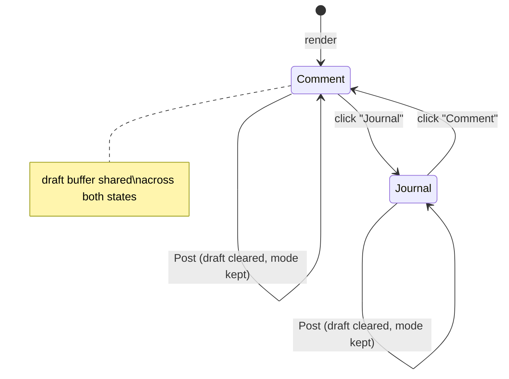

# Unified timeline composer (one box, mode toggle)

> Replace the two separate timeline composer text boxes on the task detail page — one for comments, one for journal entries — with a single textarea plus a segmented toggle that selects which kind of entry to post.

## Source

- Conversation request (no durable issue): "We shouldn't need two different text boxes, one for comments and one for journal entries. We should just use one text box and have some kind of UI element to switch between them, like a slider." Design decisions below were resolved in a grilling session; this section is the only non-durable source.

## Context

A **Task** has a timeline of **Task events**. Two of those event kinds are author-written:

- **Comment** — a markdown note for cross-actor communication, visible to all actors.
- **Journal entry** — a durable working note owned by the assignee; the agent's working memory for itself, not cross-actor communication.

(See [CONTEXT.md](../../CONTEXT.md) → Events for the canonical definitions.)

These two kinds remain distinct concepts and keep distinct backend endpoints. The only thing changing is the **input affordance**: today the composer renders two stacked `<textarea>` blocks (one per kind), each with its own draft state and its own submit button. This is visually redundant and takes double the vertical space. We are merging them into one textarea whose destination is chosen by a segmented `[ Comment | Journal ]` control.

This is a frontend-only, UI-only change. No backend, schema, type, or API changes.

## Goals

1. A single `<textarea>` in the task detail timeline composer, with a segmented two-option control to switch between posting a **Comment** and a **Journal entry**.
2. One shared draft buffer: text typed in the box is preserved when the user flips the toggle; only the destination changes.
3. The active mode drives the placeholder text (reusing today's two helper strings) and which mutation fires on submit.
4. A single neutral submit button labeled **"Post"**.
5. ⌘/Ctrl+Enter submits in the active mode.
6. After a successful post, the draft clears but the mode stays where it was.

## Non-goals

1. **No backend changes.** `POST /api/tasks/:id/comments` and `POST /api/tasks/:id/journal` are unchanged; both are still called, just from one composer.
2. **No change to the Comment / Journal entry domain concepts** — they remain separate event kinds with separate semantics (CONTEXT.md is not edited).
3. **No change to the timeline display** above the composer — the filter pills (Comments / Journal / System), the per-event rendering in `EventItem`, and the empty-state hint text all stay as-is.
4. **No persistence of the selected mode** across task switches, reloads, or sessions (no localStorage). Mode always starts at Comment on a fresh render.
5. **No change to `TaskDrawer`** — it shows a read-only timeline summary and has no composer.

## Relevant prior decisions

- No ADR governs the composer UI, and none is created for this change — it is reversible, unsurprising, and not a hard-to-reverse trade-off. It slots into the existing component structure.
- Visual language: the new segmented control should rhyme with the existing `FilterPill` components rendered directly above the composer in the same section.

## Relevant files and code

- [frontend/src/components/TaskDetail.tsx](../../frontend/src/components/TaskDetail.tsx) — the only file to change.
  - `TaskDetail` parent state: `comment`/`journal` `useState` at lines 66–67.
  - Parent → `TimelineSection` prop wiring at lines 222–233 (`comment`, `setComment`, `journal`, `setJournal`, `commentPending`, `journalPending`, `onSubmitComment`, `onSubmitJournal`).
  - `TimelineSection` component definition and its prop type, lines 517–553.
  - The two `<form>`/`<textarea>` composer blocks to replace, lines 620–680.
- [frontend/src/lib/useTaskEditor.ts](../../frontend/src/lib/useTaskEditor.ts) — provides `addComment`, `addJournal` (lines 121–141) and `commentPending`/`journalPending` (lines 233–234). **No changes**; both mutations are still used.
- [frontend/src/lib/mutations.ts](../../frontend/src/lib/mutations.ts):57,69 — underlying React Query mutations. Read-only reference.
- [CONTEXT.md](../../CONTEXT.md):131–136 — canonical Comment / Journal entry definitions (for the placeholder copy).

## Approach

The change is localized to `TimelineSection` and its parent's wiring in `TaskDetail.tsx`.

**State shape.** Today the parent holds two independent strings (`comment`, `journal`). Replace them with a single draft string plus a mode discriminator:

```ts
const [draft, setDraft] = useState("");
const [composerMode, setComposerMode] = useState<"comment" | "journal">("comment");
```

The single shared `draft` is the literal realization of "one text box" — flipping `composerMode` does not touch `draft`, so half-typed text survives a toggle (decision: shared buffer, not per-mode buffers).

**Submission.** On submit, branch on `composerMode`: call `editor.addComment(draft, …)` or `editor.addJournal(draft, …)`, each with `onSuccess: () => setDraft("")`. The mode is deliberately left untouched on success so the user can post several entries of the same kind in a row. The button's `disabled` state is `!draft.trim() || pending`, where `pending` is `commentPending` in comment mode and `journalPending` in journal mode.

**The toggle.** A small segmented control of two pills, `[ Comment | Journal ]`, styled to match the nearby `FilterPill`s, with the active option highlighted. It should be a real toggle: implement as two `<button type="button">`s inside a `role="group"` (or a `radiogroup` with `aria-checked`) so it's keyboard-operable and screen-reader-legible. The control is the persistent at-a-glance indicator of where the post will go, which is why the submit button can stay neutral ("Post").

**Placeholder + button.** Placeholder text swaps with the mode, reusing the two existing strings verbatim:
- comment: `"Add a comment — talk to other actors (markdown)"`
- journal: `"Add a journal entry — durable working notes for your future self (markdown)"`

One submit button, fixed label **"Post"**, fixed neutral styling (no more book icon, no accent/outline split). Destination is communicated by the toggle + placeholder, not the button.

**Keyboard.** Add an `onKeyDown` on the textarea: if `(e.metaKey || e.ctrlKey) && e.key === "Enter"` and `draft.trim()` and not pending, prevent default and submit the active mode.



## Step-by-step plan

1. **Swap the parent state in `TaskDetail`.** In [frontend/src/components/TaskDetail.tsx](../../frontend/src/components/TaskDetail.tsx), replace the two `useState` declarations at lines 66–67 (`comment`, `journal`) with `const [draft, setDraft] = useState("")` and `const [composerMode, setComposerMode] = useState<"comment" | "journal">("comment")`.

2. **Rewrite the parent → `TimelineSection` props.** At the call site (lines 222–233), remove `comment`/`setComment`/`journal`/`setJournal`/`commentPending`/`journalPending`/`onSubmitComment`/`onSubmitJournal`. Pass instead:
   - `draft={draft}`, `setDraft={setDraft}`
   - `composerMode={composerMode}`, `setComposerMode={setComposerMode}`
   - `pending={composerMode === "comment" ? editor.commentPending : editor.journalPending}`
   - `onSubmit={() => { const fn = composerMode === "comment" ? editor.addComment : editor.addJournal; fn(draft, { onSuccess: () => setDraft("") }); }}`

   (Keep passing `events`, `allTasks`, `projects`, `usersById`, `filter`, `toggle`, `solo`, `currentUserId`, `editor` unchanged.)

3. **Update the `TimelineSection` prop type and signature.** In the component's type literal (lines 535–552) and destructuring (lines 524–534), remove the eight old composer props and add: `draft: string`, `setDraft: (v: string) => void`, `composerMode: "comment" | "journal"`, `setComposerMode: (m: "comment" | "journal") => void`, `pending: boolean`, `onSubmit: () => void`.

4. **Replace the two composer forms with one.** Delete both `<form>` blocks (lines 620–680) and replace with a single composer containing, in order:
   - The segmented toggle: a `role="group"` wrapper with two `<button type="button">`s, "Comment" and "Journal", calling `setComposerMode("comment")` / `setComposerMode("journal")`, with active-state styling matching the `FilterPill` look. The active button should carry `aria-pressed={true}` (or use `aria-checked` in a radiogroup).
   - One `<form onSubmit>` (prevent default, guard on `draft.trim()`, call `onSubmit()`), containing:
     - One `<textarea value={draft} onChange={e => setDraft(e.target.value)} rows={2}>` with `placeholder` = the mode-dependent string (comment vs journal helper text from the Approach section), and an `onKeyDown` handler for ⌘/Ctrl+Enter submit.
     - One submit `<button type="submit">` labeled **"Post"**, `disabled={!draft.trim() || pending}`, with neutral styling (reuse the existing textarea/button utility classes for visual consistency; drop the book `<svg>`).

5. **Remove now-dead references.** Confirm no remaining references to the removed names (`comment`, `setComment`, `journal`, `setJournal`, `commentPending`, `journalPending`, `onSubmitComment`, `onSubmitJournal`) exist in `TaskDetail.tsx`. Note the local variable `journal` inside the `counts` `useMemo` (line 561) is unrelated — it counts journal events for the filter pill and must stay.

6. **Typecheck and lint the frontend.** Run `npm run typecheck` in `frontend/` and confirm clean.

## Demo seed data

Skipped — this is a UI-only change with no persistent state, new tables, or API capabilities. `backend/demo/seed.sql` already seeds comment and journal events; nothing to add.

## Testing strategy

No component/E2E tests exist in this repo (per CLAUDE.md, frontend correctness is verified manually). 

- **Manual checks** (run `npm run dev`, open a task at `/tasks/:id`):
  1. Default mode is Comment; placeholder shows the comment helper text.
  2. Type text, flip toggle to Journal → text is preserved, placeholder swaps to journal helper text.
  3. Post a comment → it appears in the timeline as a comment (and under the Comments filter pill); draft clears; mode stays on Comment.
  4. Switch to Journal, post → appears as a journal entry; draft clears; mode stays on Journal.
  5. ⌘/Ctrl+Enter submits in whichever mode is active.
  6. Submit button is disabled when the box is empty/whitespace and while a post is in flight.
  7. Toggle is keyboard-operable and the active option is visually distinct.
- **Regression risk:** none in the backend test suite (no backend change). Confirm `npm test` from root still passes (build of `shared` + backend vitest) as a sanity check that nothing in shared types was disturbed.

## Acceptance criteria

- [ ] Task detail timeline shows exactly one textarea and one segmented `[ Comment | Journal ]` toggle (no second text box).
- [ ] Toggling modes preserves the typed draft.
- [ ] Placeholder text reflects the active mode using the two existing helper strings.
- [ ] Submitting posts to the correct endpoint for the active mode; the new event renders in the timeline.
- [ ] Draft clears after a successful post; mode is unchanged.
- [ ] Submit button labeled "Post", disabled on empty/whitespace draft and while pending.
- [ ] ⌘/Ctrl+Enter submits in the active mode.
- [ ] Toggle is keyboard-accessible with a clear active state.
- [ ] No dead references to the removed composer props remain in `TaskDetail.tsx`.
- [ ] All existing tests pass (`npm test` from root).
- [ ] Typechecks clean (`npm run typecheck` in `frontend/`).

## Open questions

None — all design decisions resolved during grilling (draft buffer = shared; default mode = comment; control = segmented; button = neutral "Post"; placeholder = mode-dependent; ⌘/Ctrl+Enter submit added; mode persists after post).
